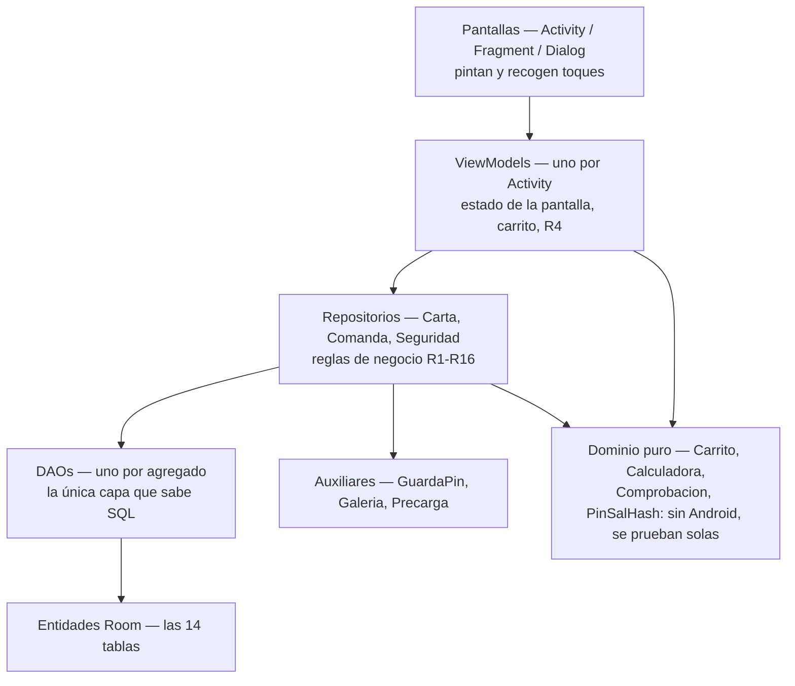
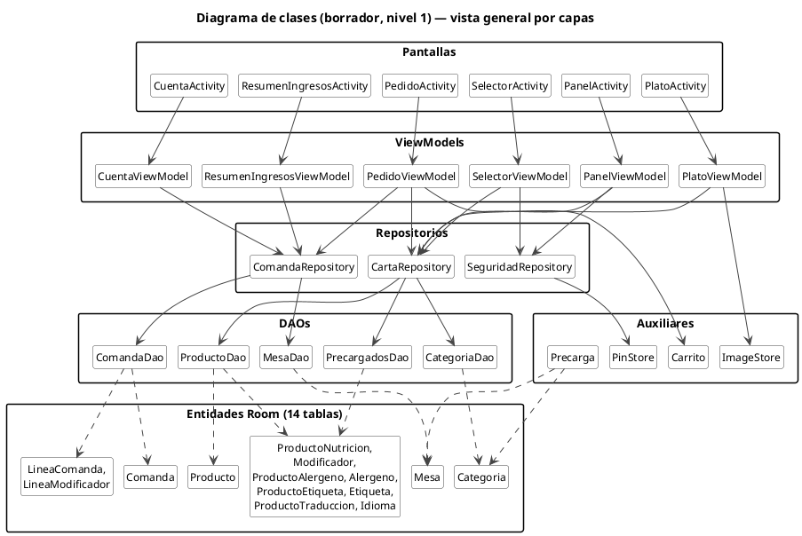
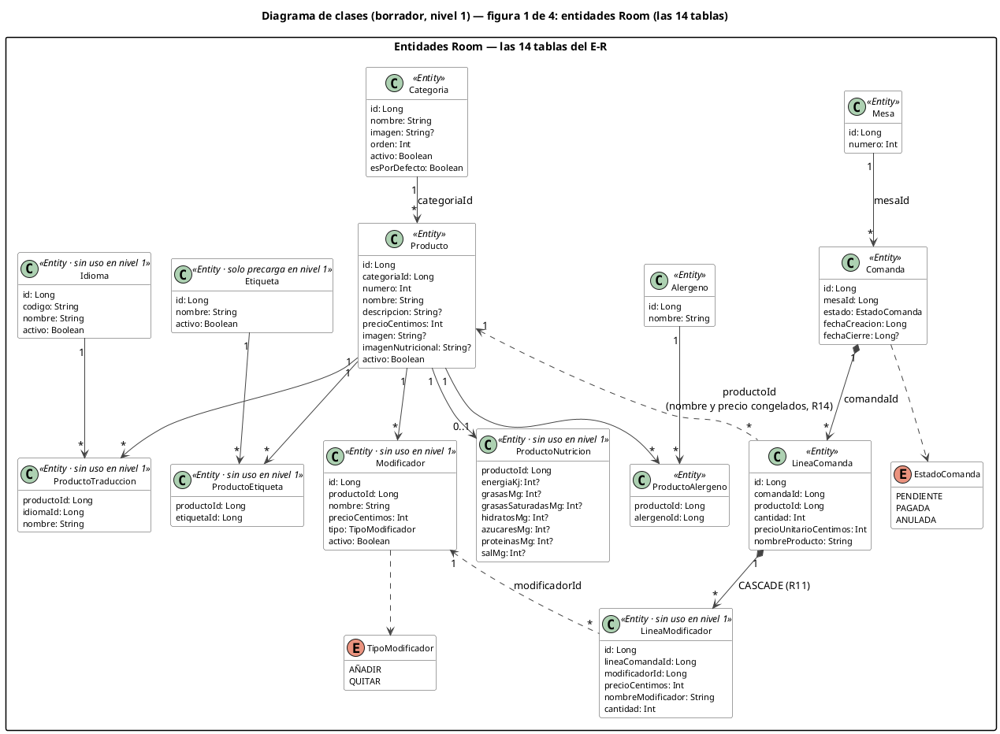
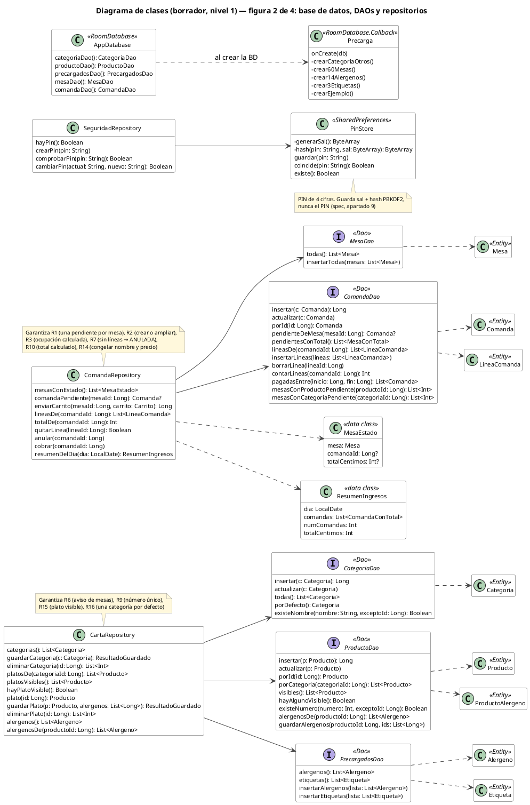
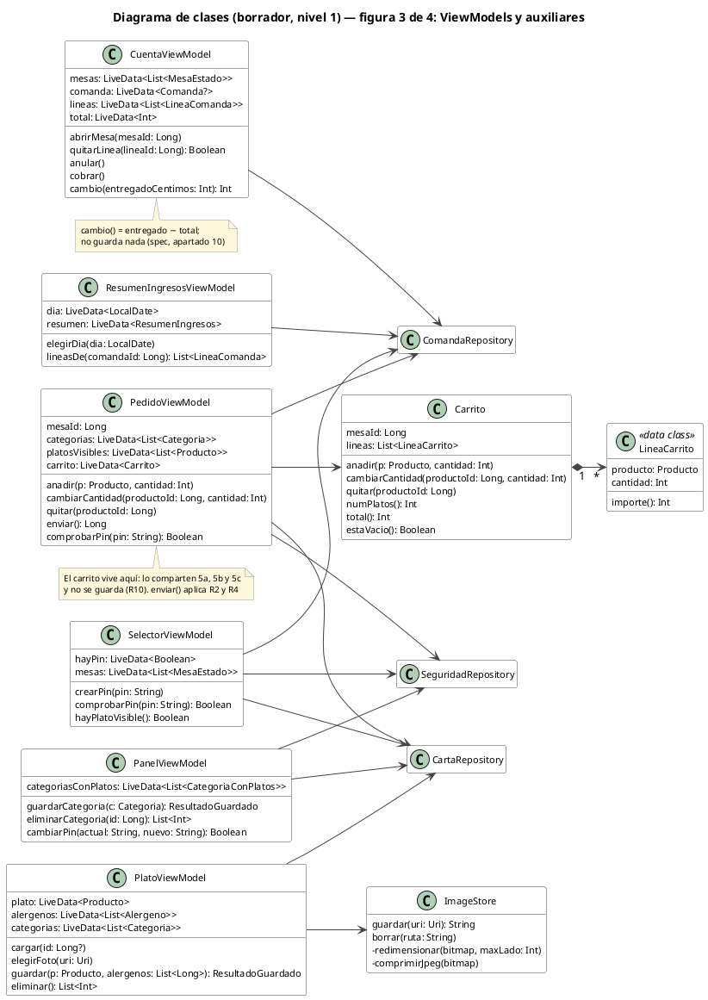
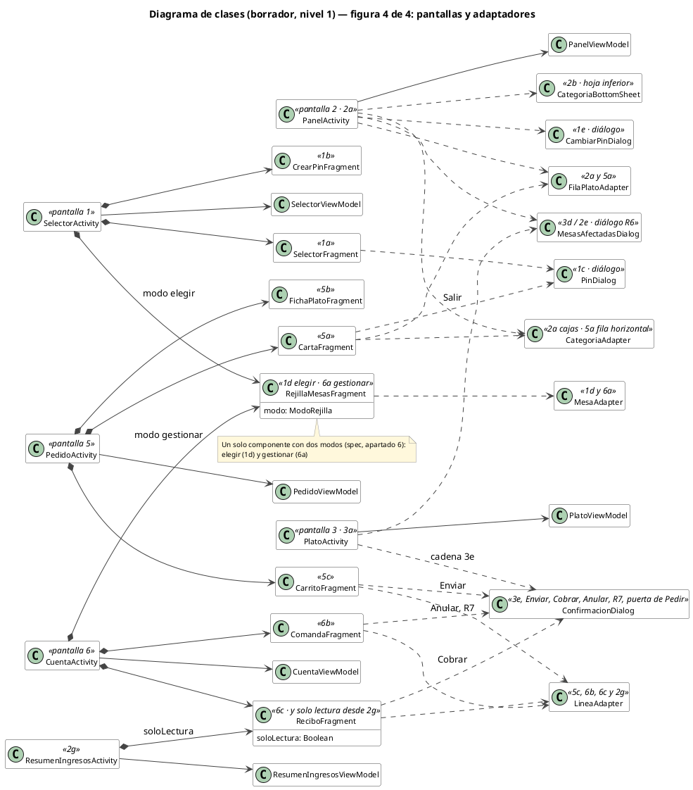

> **Borrador del diagrama de clases del prototipo (nivel 1). Es parte del diseño: manda junto con el spec y las fichas. Alimenta el apartado 5 (clases y métodos clave) y el apartado 7 (diagrama de clases) de la memoria. Los archivos (PNG, SVG y `.puml` por figura) viven en el PC, en `Proyecto intermodular\Imágenes\Diagramas\` (ruta de la reorganización del 17-18 sep, P164).**
> **Actualizado en la fase 5b (24 sep 2026):** **P238 → A**: `ResumenDiaActivity`, `ResumenDiaViewModel` y la data class `ResumenDia` pasan a **`ResumenIngresosActivity`, `ResumenIngresosViewModel` y `ResumenIngresos`** (vocabulario de P149), cambiado en el texto y en los `.puml` de abajo; **las figuras PNG no se redibujan** (el diagrama definitivo sale del código en la fase 7). **P237** (repositorios en `datos/repositorios/`, `Hash` en `dominio/`) y **P243** (qué comprueba `Validacion`), en las tablas de los apartados 1 y 3.3. Ruta del PC corregida (P164).
> Creado el **17 de septiembre de 2026**, fase 2d, bloque 7 (P104-P112). Motivos en la entrada de la fase 2d de `diario+doc-decisiones.md`.
> **Actualizado el 17 de septiembre de 2026, en el cierre de la fase 2d.** Cuatro cambios, todos anotados sin redibujar las figuras: **el paquete raíz es `yunkang.ako`** (P138); **nacen tres clases de dominio puro —`Calculadora`, `Validacion` y `Hash`— en un paquete `dominio/` separado de `datos/`**, y `cambio()` y `hash()` **dejan de vivir** en `CuentaViewModel` y en `PinStore` (bloque 10); **`PinStore` lleva el algoritmo del PIN fijado** (P126); y **el aviso de platos sin enviar (RF-38) usa `ConfirmacionDialog`** y comparte caja con el de cobrar (P121). **Las cinco figuras siguen siendo las del bloque 7 y no muestran las tres clases nuevas: el diagrama definitivo de la fase 7, generado desde el código, sí las recoge.** Se retira el apartado *Pendiente de volcar*, ya consumido.
> **Actualizado el 10 de octubre de 2026 (parte 3 de la S13.5):** nombres nuevos puestos por Daniel: `Validacion` → `Comprobacion`, `LineaCarrito` → `PlatoApuntado`, `Hash` → `PinSalHash`, `PinStore` → `GuardaPin` e `ImageStore` → `Galeria`. El texto ya los usa; las figuras PlantUML siguen con los nombres del bloque 7 hasta que se rehagan desde el código en la fase 7.
> **Es un borrador.** Los nombres de clases y métodos los propuso Claude a partir de las fichas y las reglas R1-R16; **el diagrama definitivo se genera en la fase 7 desde el código real** (spec, apartado 12), y ahí cambiarán nombres. Lo que este documento fija es la **estructura**: capas, número de clases y quién habla con quién.

# Diagrama de clases — borrador, nivel 1

## 1. Qué es y qué se decidió

Un **diagrama de clases** es el plano de cómo se organiza el **código**: qué clases hay, qué atributos (con tipo) y qué métodos tiene cada una, y cómo se relacionan. Se diferencia del E-R en que el E-R describe **datos guardados** (tablas y claves) y no tiene comportamiento; el de clases describe **código** y por eso puede enseñar lo que no se guarda: el **carrito** (R10), el **PIN** (SharedPreferences, no Room), la **calculadora de cambio** y la lógica de las reglas de negocio.

| Decisión | Qué se fijó | P |
|---|---|---|
| Alcance | **Solo nivel 1** (spec, apartado 16), con el nivel anotado. Las 14 entidades entran todas porque las 14 tablas se crean desde el primer día; las que el nivel 1 no usa llevan la marca *«sin uso en nivel 1»*. Cada incremento de la 6b obliga a redibujar la figura afectada, como con los wireframes. **La excepción ya está escrita en el spec, apartado 16.5** (cierre de la 2d) | P104 |
| Notación | **PlantUML** (la misma herramienta que los casos de uso, P77); el E-R sigue en Mermaid. Ninguno de los documentos oficiales (guion, plantilla, normativa) fija herramienta; se eligió por la regla de Daniel *"lo que no vaya al documento se hace de la mejor forma para Claude Code"* y porque la letra impresa sale mayor que con Mermaid en las cuatro figuras | P105 |
| DAOs | **Uno por agregado**: `CategoriaDao`, `ProductoDao` (con alérgenos; en nivel 2, nutrición, modificadores, etiquetas y traducciones), `PrecargadosDao`, `MesaDao`, `ComandaDao` (con líneas) | P106 |
| Repositorios | **Tres**: `CartaRepository`, `ComandaRepository`, `SeguridadRepository`. Cada uno garantiza las reglas de su parte; el PIN no es Room | P107 |
| Pantallas y ViewModels | **Una Activity por pantalla de las fichas** (1, 2, 3, 2g, 5, 6); las vistas 5a/5b/5c y 6a/6b/6c son Fragments dentro de su Activity; **un ViewModel por Activity**. El carrito vive en `PedidoViewModel` y lo comparten 5a, 5b y 5c | P108 |
| Clases fuera de Room | Entran `GuardaPin`, `Galeria`, `Precarga`, `Carrito` y `PlatoApuntado`, como auxiliares | P109 |
| Atributos | Las entidades llevan sus campos **con tipos Kotlin y nulabilidad** (`imagen: String?`) | P111 |
| Figuras | **Vista general** (solo nombres, por capas) en el cuerpo de la memoria; **cuatro figuras detalladas** (entidades · base de datos, DAOs y repositorios · ViewModels y auxiliares · pantallas y adaptadores) en un anexo, una por página. Sustituye a P110 (dos figuras), que medidas salían a 3,6-3,9 pt | P112 |
| **Paquete raíz** | **`yunkang.ako`** (cierre de la 2d) | P138 |
| **Dominio puro** | **Paquete `dominio/`, separado de `datos/`**, con `Carrito`, `PlatoApuntado` y **tres clases nuevas: `Calculadora`, `Comprobacion` y `PinSalHash`** (bloque 10). **P237 → B (5b, 24 sep, delegada a Claude [Claude]): `PinSalHash` vive en `dominio/` (es puro: solo `javax.crypto`) y los repositorios viven en `datos/repositorios/`, no en `dominio/`, porque usan Room; `seguridad/` se queda solo con `GuardaPin`.** Así es verdad que todo `dominio/` se prueba sin emulador | P237 |

**Regla de Daniel fijada en este bloque (P112):** *lo que no vaya al documento ni a la presentación se hace de la mejor forma posible para Claude Code; no se recorta.*

**Interfaz:** vistas XML (`ConstraintLayout`, `dp`/`sp`, Glide), no Jetpack Compose — ya decidido en el spec, apartado 6 y apartado 15.

## 2. Inventario — 5 figuras, 58 clases

| Archivo | Figura | Página | Letra impresa (aprox.) |
|---|---|---|---|
| `clases-vista-general` | Vista general por capas: 30 cajas, solo nombres | Apaisada, cuerpo de la memoria | ~9 pt |
| `clases-entidades` | Figura 1 de 4: 14 entidades Room + 2 enumeraciones, con atributos | Apaisada, anexo | ~5,6 pt |
| `clases-acceso` | Figura 2 de 4: `AppDatabase`, `Precarga`, 5 DAOs, 3 repositorios, `PinStore`, 2 data class | Vertical, anexo | ~4,7 pt |
| `clases-viewmodels` | Figura 3 de 4: 6 ViewModels, `Carrito`, `LineaCarrito`, `ImageStore` | Vertical, anexo | ~5,7 pt |
| `clases-pantallas` | Figura 4 de 4: 6 Activities, 8 Fragments, 5 diálogos/hojas, 4 adaptadores | Vertical, anexo | ~5,1 pt |

Cada figura existe en `.png` (200 dpi), `.svg` y `.puml` (código fuente PlantUML, para regenerar).

> **Las 58 clases son las del bloque 7.** Las tres de dominio puro del bloque 10 (`Calculadora`, `Comprobacion`, `PinSalHash`) **no están dibujadas**: se decidieron después y redibujar dos figuras exige Java y Graphviz en el PC. **Están descritas en el apartado 3.3 y en `spec-claude-code.md`, apartado 3**, y **el diagrama definitivo de la fase 7 —que sale del código— las recogerá**. Contando las tres, la estructura del prototipo son **61 clases**.

## 3. Capas y clases

Cada capa habla solo con la de abajo. Las pantallas no ven los repositorios; los ViewModels no ven los DAOs. **El dominio puro no ve a nadie**: son funciones que reciben datos y devuelven datos, y por eso las seis pruebas de `test/` corren sin emulador.

### 3.1 Entidades Room (figura 1)

Las 14 tablas del spec, apartado 5, una clase `@Entity` por tabla, con los campos en tipos Kotlin. Convenciones: `Long` para claves, `Int` para céntimos, cantidades y números de plato/mesa, `Long` (epoch millis) para fechas, `?` donde el E-R marca nulable (P69). Dos enumeraciones: `EstadoComanda` (PENDIENTE / PAGADA / ANULADA) y `TipoModificador` (AÑADIR / QUITAR).

| Marca en la figura | Entidades | Por qué |
|---|---|---|
| `«Entity»` | Categoria, Producto, Alergeno, ProductoAlergeno, Mesa, Comanda, LineaComanda | Las usa el nivel 1 |
| `«Entity · solo precarga en nivel 1»` | Etiqueta | Se precargan las 3; los chips son el incremento 1 |
| `«Entity · sin uso en nivel 1»` | ProductoNutricion, Modificador, LineaModificador, ProductoEtiqueta, Idioma, ProductoTraduccion | La tabla existe desde el primer día (spec, apartado 16, transversal); ningún código del nivel 1 la lee ni la escribe |

Relaciones dibujadas: las claves foráneas del E-R, con `*-->` (composición) en `Comanda → LineaComanda` y `LineaComanda → LineaModificador` (la única CASCADE, R11), y con línea discontinua las dos referencias "congeladas" (`LineaComanda → Producto`, `LineaModificador → Modificador`, R14).

> **Ninguna entidad declara `CHECK`.** Los `>= 0` del spec, apartado 5 son restricción del dominio y **los garantiza `Comprobacion`**, llamada desde los repositorios (R8, verificación 9). Room no genera `CHECK` ni índices parciales.

### 3.2 Base de datos, DAOs y repositorios (figura 2)

| Clase | Tipo | Responsabilidad | Reglas que garantiza |
|---|---|---|---|
| `AppDatabase` | `RoomDatabase` | Declara las 14 entidades y expone los 5 DAOs | — |
| `Precarga` | `RoomDatabase.Callback` | En `onCreate`: categoría *Otros* (`esPorDefecto = true`), 60 mesas, 14 alérgenos, 3 etiquetas, 1 categoría y 1 plato de ejemplo (spec, apartado 11) | R16 (la categoría por defecto existe antes que cualquier plato) |
| `CategoriaDao` | `@Dao` | insertar, actualizar, todas, porDefecto, existeNombre | — |
| `ProductoDao` | `@Dao` | insertar, actualizar, porId, porCategoria, **visibles** (JOIN con categoría activa), hayAlgunoVisible, **existeNumero**, alergenosDe, guardarAlergenos (transacción) | R15 en la consulta; R9 en existeNumero |
| `PrecargadosDao` | `@Dao` | alergenos, etiquetas (lectura) e inserción para la precarga | — |
| `MesaDao` | `@Dao` | todas, insertarTodas | — |
| `ComandaDao` | `@Dao` | insertar, actualizar, porId, **pendienteDeMesa**, pendientesConTotal, lineasDe, insertarLineas, borrarLinea, contarLineas, **pagadasEntre**, mesasConProductoPendiente, mesasConCategoriaPendiente | Consultas de R3, R6 y del Resumen de ingresos |
| `CartaRepository` | clase | categorias, guardarCategoria, eliminarCategoria → mesas afectadas, platosDe, platosVisibles, hayPlatoVisible, plato, guardarPlato (con alérgenos), eliminarPlato → mesas afectadas, alergenos, alergenosDe | **R6, R8** (llamando a `Comprobacion`), **R9, R15, R16** |
| `ComandaRepository` | clase | mesasConEstado, comandaPendiente, **enviarCarrito** (crea o amplía), lineasDe, totalDe, **quitarLinea** (devuelve si la comanda quedó anulada), anular, cobrar (fechaCierre), resumenDelDia | **R1, R2, R3, R7, R8** (al congelar el precio), **R10, R14** |
| `SeguridadRepository` | clase | hayPin, crearPin, comprobarPin, cambiarPin | — |
| `GuardaPin` | SharedPreferences | generarSal (`SecureRandom`, 16 bytes), guardar, leer, existe. **Nunca guarda el PIN**, solo sal + hash (spec, apartado 9). **El cálculo del hash ya no vive aquí: lo hace `PinSalHash`** (bloque 10) | — |
| `MesaEstado` | data class | mesa + comandaId? + totalCentimos? — una fila de la rejilla (R3: la ocupación se calcula) | R3 |
| `ResumenIngresos` | data class | dia, comandas con total, numComandas, totalCentimos | R10 |

`ResultadoGuardado` (no dibujado, es un tipo de retorno) dice si se guardó o por qué no: número repetido (R9), nombre repetido, **precio negativo (R8)**, categoría eliminada (dispara la cadena 3e en la pantalla).

### 3.3 ViewModels, dominio puro y auxiliares (figura 3)

| ViewModel | Activity | Estado que guarda | Métodos | Usa |
|---|---|---|---|---|
| `SelectorViewModel` | 1 | hayPin, mesas (para 1d) | crearPin, comprobarPin, hayPlatoVisible (puerta de Pedir) | Seguridad, Carta, Comanda |
| `PanelViewModel` | 2 | categoriasConPlatos | guardarCategoria, eliminarCategoria, cambiarPin (1e) | Carta, Seguridad |
| `PlatoViewModel` | 3 | plato, alergenos, categorias | cargar, elegirFoto, guardar, eliminar | Carta, Galeria |
| `ResumenIngresosViewModel` | 2g | dia, resumen | elegirDia, lineasDe (recibo en solo lectura) | Comanda |
| `PedidoViewModel` | 5 | mesaId, categorias, platosVisibles, **carrito** | anadir, cambiarCantidad, quitar, **enviar** (R2, R4), comprobarPin (salir de Pedir, P41) | Carta, Comanda, Seguridad, Carrito |
| `CuentaViewModel` | 6 | mesas, comanda, lineas, total | abrirMesa, quitarLinea (R7), anular, cobrar, **cambio → llama a `Calculadora`** | Comanda, Calculadora |

**Dominio puro (paquete `dominio/`)** — ninguna de estas clases importa nada de Android, y ahí está su razón de ser: **son las seis pruebas de `test/`**.

| Clase | Qué hace | Prueba |
|---|---|---|
| `Carrito` | mesaId, lineas; `anadir` suma en la misma línea si el plato ya está; `cambiarCantidad`, `quitar`, `numPlatos`, `total`, `estaVacio` — **R4 y R10** | P-C-02, P-C-03 |
| `PlatoApuntado` | producto, cantidad, `importe()` — **R10** | P-C-01 |
| **`Calculadora`** | `cambio(totalCentimos, entregadoCentimos)` = entregado − total; puede salir negativo y no lanza nada. **No guarda nada** (spec, apartado 10) | P-C-04 |
| **`Comprobacion`** | `precioValido(centimos)`: **lanza excepción si es negativo** (**R8**). La llaman los tres repositorios antes de guardar un plato, un modificador o una línea. **También `cantidadValida(n)` (1-99, R4) y `pinValido(pin)` (cuatro cifras)** — P243 → A (5b): las tres comprobaciones que ya listaba `spec-claude-code.md`, apartado 3 | **P-C-09** (y P-C-03 por la cantidad) |
| **`PinSalHash`** | `pbkdf2(pin, sal)` y `coincide(pin, sal, hash)`: **`PBKDF2withHmacSHA256`, 100 000 iteraciones, clave de 256 bits** (P126). Solo calcula; **guardar es cosa de `GuardaPin`** | P-C-05 |

> **Por qué nacieron las tres** (bloque 10). En el borrador, `cambio()` vivía en `CuentaViewModel` y `hash()` dentro de `GuardaPin`. Probar un ViewModel arrastra `LiveData` y exige `InstantTaskExecutorRule`; probar `GuardaPin` arrastra SharedPreferences, que no existe fuera de Android. **Separar *calcular* de *guardar* y de *pintar*** deja seis pruebas que corren en el PC en segundos, y de paso da un sitio donde poner `Comprobacion`, que antes no existía porque se daba por hecho que R8 la imponía la base de datos.

**Otro auxiliar:** `Galeria` (guardar = redimensionar a ~1080 px + JPEG + archivo privado, devuelve la ruta; borrar — spec, apartado 15).

### 3.4 Pantallas y adaptadores (figura 4)

| Activity | Ficha | Contiene | Diálogos y hojas |
|---|---|---|---|
| `SelectorActivity` | 1 | `SelectorFragment` (1a), `CrearPinFragment` (1b), `RejillaMesasFragment` en modo *elegir* (1d) | `PinDialog` (1c) |
| `PanelActivity` | 2 | (vista única, 2a) | `CategoriaBottomSheet` (2b), `CambiarPinDialog` (1e), `MesasAfectadasDialog` (2e) |
| `PlatoActivity` | 3 | (vista única, 3a) | `MesasAfectadasDialog` (3d), `ConfirmacionDialog` (cadena 3e) |
| `ResumenIngresosActivity` | 2g | `ReciboFragment` con `soloLectura = true` | — |
| `PedidoActivity` | 5 | `CartaFragment` (5a), `FichaPlatoFragment` (5b), `CarritoFragment` (5c) | `PinDialog` (Salir), **`ConfirmacionDialog` (Enviar, y el aviso de platos sin enviar de RF-38)** |
| `CuentaActivity` | 6 | `RejillaMesasFragment` en modo *gestionar* (6a), `ComandaFragment` (6b), `ReciboFragment` (6c) | `ConfirmacionDialog` (Anular, quitar la última línea R7, Cobrar) |

**Componentes reutilizados** (es el argumento *"se reutiliza el componente, no la pantalla"* del spec, apartado 6): `RejillaMesasFragment` (un componente, dos modos: 1d y 6a), `ReciboFragment` (6c y el recibo en solo lectura de 2g), `ConfirmacionDialog` (una caja para todas las confirmaciones, como en los wireframes), `FilaPlatoAdapter` (fila de plato en 2a y 5a), `CategoriaAdapter` (cajas en 2a, fila horizontal en 5a), `MesaAdapter` (1d y 6a), `LineaAdapter` (5c, 6b, 6c y 2g).

> **El aviso de platos sin enviar (RF-38) no es una clase nueva** (P121, bloque 8): es `ConfirmacionDialog` con otro texto, y en los wireframes **comparte caja con `dialogo-cobrar`**. Se anota aquí porque al contar clases es fácil inventarse un `AvisoSalirDialog` que no existe.

## 4. Código fuente de las figuras (PlantUML)

Los cinco `.puml` están en `Imágenes\Diagramas\`. Se regeneran con `java -jar plantuml.jar -tpng -Sdpi=200 clases-*.puml` (necesita Graphviz). Se reproducen aquí para que ningún documento del Project dependa de un archivo del PC.

> **Son los del bloque 7.** No incluyen `Calculadora`, `Comprobacion` ni `PinSalHash`, ni el paquete `yunkang.ako`. **No se regeneran ahora**: el diagrama que va a la memoria en el apartado 7 se genera en la fase 7 desde el código real, y será el que las recoja.

### clases-vista-general.puml

### clases-entidades.puml

### clases-acceso.puml

> **Lo que esta figura ya no refleja:** `PinStore.hash()` se saca a `Hash` (dominio puro) y los repositorios llaman a `Validacion.precioValido()` antes de guardar. Decidido en el bloque 10, después de dibujarla.

### clases-viewmodels.puml

> **Lo que esta figura ya no refleja:** `CuentaViewModel.cambio()` delega en `Calculadora.cambio()`, y el paquete `dominio/` suma `Calculadora`, `Validacion` y `Hash` junto a `Carrito` y `LineaCarrito`.

### clases-pantallas.puml

