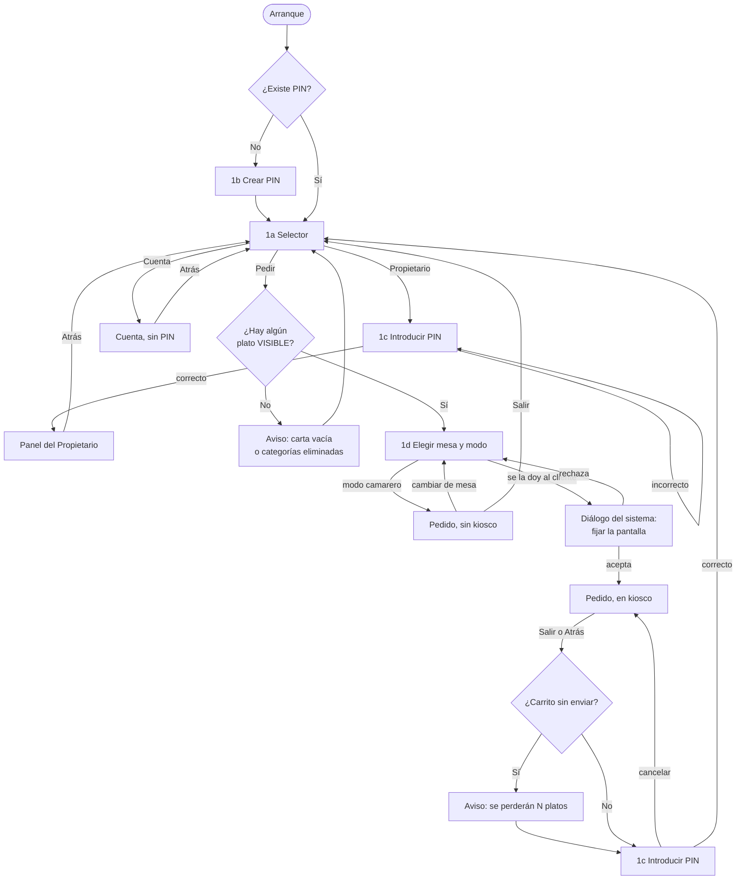
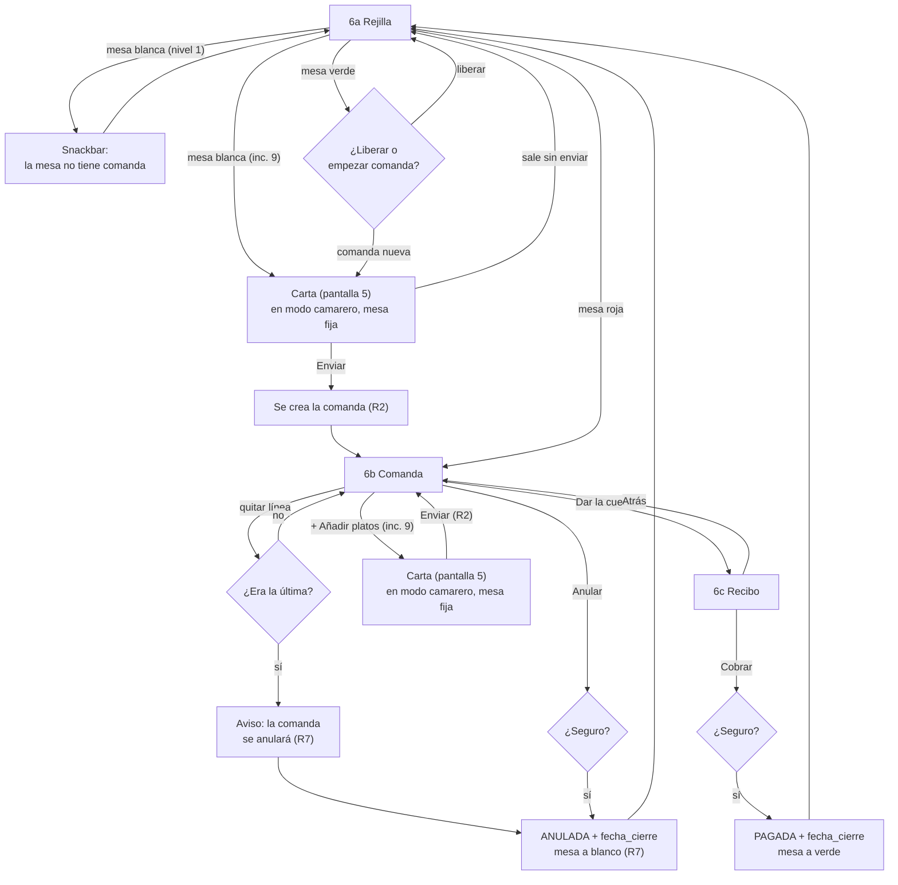
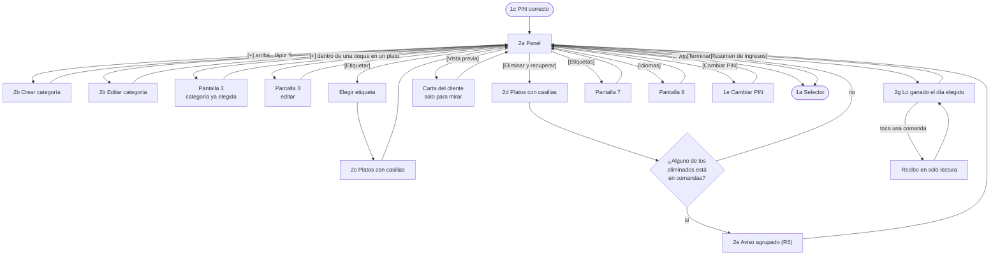
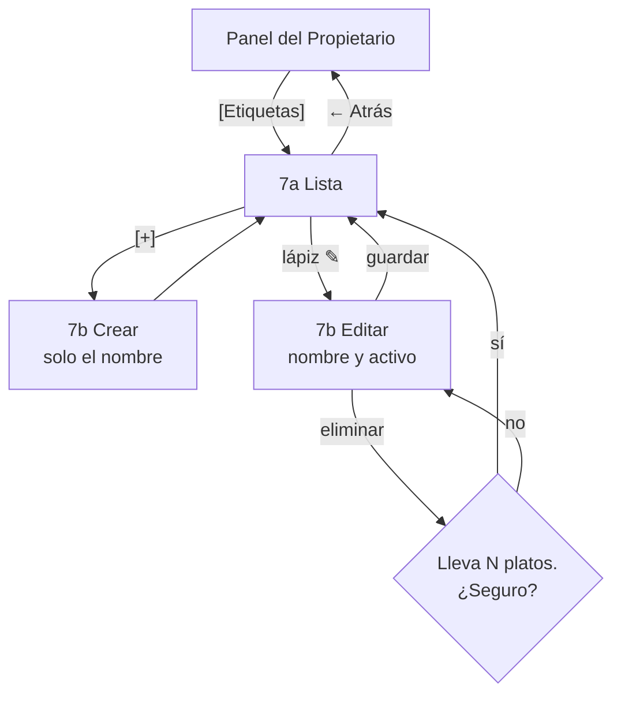
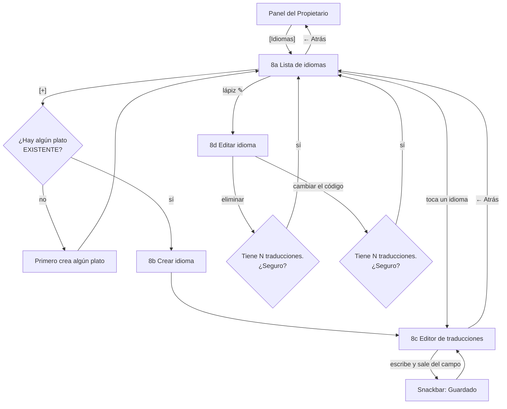

> **Fichas de pantalla: qué hace cada una, sus validaciones, casos límite y errores. Es parte del diseño: manda junto con `spec+doc-diseno-app.md`, que enlaza aquí desde su apartado 6. Alimenta el apartado 5 (Contenidos), las fichas de casos de uso y los wireframes. Se reescribe entero.**
> **Actualizado en la fase 5b (24 sep 2026):** **P224 · categoría sin foto con «?»** (fila 32 del registro: cuatro filas de las fichas 2 y 5) y corregida la línea de vocabulario *eliminar / desactivar* del arranque, que decía lo contrario de P153.
> Última actualización: **17 de septiembre de 2026 — CIERRE DE LA FASE 2d.** Volcadas las filas del registro que tenían las fichas por destino: **la disposición de la pantalla 5 pasa a móvil** (fila de categorías con scroll horizontal, "Mesa N" en la barra, carrito como pastilla) y **los croquis de tablet quedan superados por los wireframes, con nota y sin borrarse**; **rejilla de mesas 4 × 15 con el total a 12 sp**; **cajas del Panel de 270 dp**; **quitar línea desde Cuenta sube al nivel 1**; **la pantalla 2g queda descrita entera**; **la tabla nutricional gana el título fijo *"Valores por ración"***; **el algoritmo del PIN queda fijado** y se retira el *"verificar en la 2d"*; se corrige el motivo de no usar el pulsado largo; y **los números de incremento se renumeran** al pasar el nivel 2 a once. Motivos en la entrada de la fase 2d de `diario+doc-decisiones.md`.
> Anterior: **17 de septiembre de 2026 — comprobación tras la revisión en frío (P40-P44).** **Una sola carta**: Cuenta abre la pantalla 5 en modo camarero, fijada a la mesa; se retiran la *versión compacta* y el campo para teclear el número (ficha 5 y ficha 6). *Modo camarero* significa solo Pedir sin fijar pantalla (ficha 1). En el nivel 1 salir de Pedir pide el PIN (ficha 1), y el aviso R6 de categorías (ficha 2) y la cadena 3e (ficha 3) suben al nivel 1.
> Anterior: **16 de septiembre de 2026 — revisión en frío.** Cambian **los niveles** de varias vistas (el reparto definitivo está en el **apartado 16 del spec**, que manda sobre las líneas de nivel de estas fichas), el **dispositivo** (móvil vertical) y el **Resumen de ingresos** (2g, nivel 1, con selector de fecha). Ninguna validación ni caso límite cambia.
> Anterior: 14 de septiembre de 2026 — cierre de la fase 2c, con las siete pantallas y los cambios de la auditoría de cierre incorporados.

# Fichas de pantalla

## Cómo se lee una ficha

Cada pantalla se cierra con los mismos apartados: **para qué sirve · nivel de alcance · vistas que incluye · flujo · validaciones, casos límite y errores · reglas implicadas · decisiones y su motivo**. Es casi literalmente la ficha de caso de uso.

- **Nivel** remite a los tres niveles de alcance (1 núcleo, 2 diferencial, 3 si da tiempo). **Desde el 16 de septiembre, el nivel 1 es lo único obligatorio; el nivel 2 son incrementos ordenados que entran si da tiempo.** El reparto por vistas está en el **apartado 16 del spec**; cuando una ficha y ese apartado discrepen, manda el apartado 16. **Los números de incremento de estas fichas son los de la lista de once** fijada en el cierre de la 2d.
- **Dispositivo:** móvil Android en vertical. **Los croquis en texto de estas fichas se dibujaron pensando en una tablet y están superados por los 21 wireframes** de `spec+doc-wireframes.md` (bloque 6). **No se borran**: enseñan de dónde viene cada pantalla y cada uno lleva su nota. **Donde el croquis y el wireframe discrepen, manda el wireframe.** Las validaciones y los flujos no cambiaron con el cambio de dispositivo.
- **Vista** es cada cosa distinta que ve el usuario.
- **Pantalla, diálogo u hoja — regla fijada en el bloque 6 (P84):**

| Forma | Cuándo se usa | Ejemplos |
|---|---|---|
| **Diálogo** | **Una sola pregunta** de sí o no | Anular una comanda · confirmar el cobro · el aviso de R6 · salir con platos sin enviar |
| **Hoja inferior** *(bottom sheet)* | **Formulario corto**, de dos o tres campos, sin foto | 3b Modificador · 2b Crear categoría · 7b Crear etiqueta |
| **Pantalla completa** | Lleva **foto**, una **lista larga**, o **no tiene nada detrás que merezca seguir viéndose** | 3a Formulario del plato · 8c Editor de traducciones · 2g Resumen de ingresos · 6c Recibo |

- **Vocabulario obligatorio, fijado en la auditoría:** un **plato existente** es toda fila de `producto`; un **plato visible** es el que el cliente ve, o sea **en la carta, disponible y con su categoría activa** (R15). Cada ficha dice cuál de los dos usa. **Eliminar ≠ desactivar (P153, 17 sep):** un plato, una categoría, una etiqueta o un idioma se **elimina** (sale de la carta para siempre, `activo = false`, la fila nunca se borra) y se **recupera**; un plato, además, se **desactiva** solo cuando está agotado (`disponible = false`, nivel 2, incremento 12) y se **activa** al reponerlo. *(Corregido en la 5b, 24 sep: esta línea decía lo contrario, un resto anterior a P153.)*
- **Tres componentes se comparten entre fichas** (bloque 7, al dibujar el diagrama de clases): **`ConfirmacionDialog`** (todos los avisos de sí/no), **`RejillaMesasFragment`** (la rejilla de 60 mesas, en 1d y en 6a) y **`ReciboFragment`** (el recibo, en 6c y en solo lectura desde 2g). Nombres borrador; el definitivo sale del código en la fase 7.

## Inventario de pantallas

| # | Pantalla | Vistas que incluye | Estado |
|---|---|---|---|
| **1** | **Selector de rol** | 1a Selector · 1b Crear PIN · 1c Introducir PIN · 1d Elegir mesa y modo · 1e Cambiar PIN | **Cerrada** |
| **5** | **Pedido (componente compartido)** | 5a Carta · 5b Ficha del plato · 5c Carrito · 5d Selector de idioma · 5e Lo pedido por la mesa (nivel 3) · la abre también Cuenta, en modo camarero (17 sep) | **Cerrada** |
| **6** | **Cuenta** | 6a Rejilla de mesas · 6b Comanda de la mesa · 6c Recibo y cobro | **Cerrada** |
| **3** | **Alta y edición de plato** | 3a Formulario · 3b Modificador · 3c Tabla nutricional · 3d Aviso de mesas afectadas · **3e Aviso de categoría eliminada** | **Cerrada** |
| **2** | **Panel del Propietario** | 2a Panel · 2b Crear o editar categoría · 2c Etiquetar · 2d Eliminar y recuperar · 2e Aviso de mesas afectadas · 2f Vista previa · **2g Resumen de ingresos** · aloja 1e Cambiar PIN | **Cerrada** |
| **7** | **Gestión de etiquetas** | 7a Lista · 7b Crear o editar etiqueta | **Cerrada** |
| **8** | **Idiomas y traducciones** | 8a Lista de idiomas · 8b Crear idioma · 8c Editor de traducciones · 8d Editar idioma | **Cerrada** |
| ~~4~~ | ~~Gestión de mesas~~ | — | **Eliminada** el 12 de septiembre. **El número 4 queda libre y no se reutiliza** |
| ~~—~~ | ~~Gestión de categorías~~ | — | **Eliminada** el 14 de septiembre: vive dentro de la pantalla 2 |

---

## Pantalla 1 — Selector de rol

**Para qué sirve:** es la puerta de entrada. Decide quién usa el móvil y guarda las **dos puertas del PIN**: entrar como Propietario y salir de Pedir.

**Nivel 1**, salvo el modo kiosco y su interruptor, que son **nivel 2 (incremento 2)**. **En el nivel 1 salir de Pedir pide siempre el PIN** (17 de septiembre, P41): sin el interruptor, Pedir se comporta como *modo cliente* sin fijar la pantalla. La **salida libre** del modo camarero llega con el interruptor.

### Vistas

| Vista | Cuándo aparece | Qué tiene |
|---|---|---|
| **1a Selector** | En cada arranque, salvo el primero | **El nombre de la app arriba y, debajo, tres botones grandes apilados en vertical**: **Propietario**, **Pedir** y **Cuenta** (P101, bloque 6). Grandes porque son el objetivo táctil más fácil de acertar de toda la app y porque los pulsa gente que no ha visto la app nunca **Los tres botones, rellenos en naranja (10 oct 2026).** **Arriba a la derecha (extra S15, 10 oct 2026):** un icono para cambiar entre modo claro y oscuro (luna en claro, sol en oscuro); se recuerda al volver a abrir y, sin tocarlo, sigue al móvil |
| **1b Crear PIN** | **Solo en el primer arranque, y es obligatoria** | El PIN se escribe **dos veces**. Aviso visible: *"Si lo olvidas, no se puede recuperar"* |
| **1c Introducir PIN** | Al entrar en Propietario y al salir de Pedir en modo cliente | Cuatro cifras, ocultas. Botón de cancelar |
| **1d Elegir mesa y modo** | Al entrar en Pedir | **La rejilla de mesas en modo *elegir*** (`RejillaMesasFragment`). Al elegir mesa, el interruptor **"Se la doy al cliente"** |
| **1e Cambiar PIN** | Desde el Panel del Propietario | PIN actual, y después el nuevo dos veces |

### La rejilla en modo *elegir* (1d) — precisado en la auditoría

La rejilla de 60 mesas es **el mismo componente** que la pantalla 6a, pero **el toque significa otra cosa**, y por eso se escriben los dos modos:

| Modo | Dónde | Qué significa tocar una mesa |
|---|---|---|
| **Elegir** | **1d** | *"Voy a pedir para esta mesa."* **Cualquier mesa es elegible**, del color que sea |
| **Gestionar** | **6a** | Roja → abrir su comanda · Verde → Liberar o Empezar comanda nueva · Blanca → avisa de que no tiene comanda (nivel 1) o abre la carta (incremento 9) |

**En 1d se ven los colores y los totales**, porque le dicen al camarero de un vistazo dónde hay ya comanda abierta antes de ponerse a pedir, y el dato ya está calculado.

**Medidas, fijadas en el bloque 6 y corregidas en el 9:** **4 columnas × 15 filas**, celdas de unos **73 dp**, con scroll vertical. El número de mesa grande y, en las rojas, **el total a 12 sp**. *(Se había fijado en 11 sp, P98; el bloque 9 lo subió a 12 sp al comprobar que el mínimo recomendado por las guías de accesibilidad de Android es 12 sp — P130. Los wireframes 1d y 6a se retocan con ese cambio.)*

### El interruptor "Se la doy al cliente"

Existe porque **el Camarero también usa el rol Pedir**: hay bares donde el propietario quiere mantener el trato en persona.

| Posición | Qué hace |
|---|---|
| **Activado** | Se fija la pantalla (modo kiosco) y **salir pide el PIN**. El móvil se queda en la mesa |
| **Desactivado** | **Sin kiosco, salida libre**, y un botón para **cambiar de mesa sin salir** |

Sin este interruptor, un camarero tomando comandas mesa por mesa tendría que teclear el PIN en cada mesa.

### Flujo



### Validaciones, casos límite y errores

| Caso | Qué pasa |
|---|---|
| **Primer arranque** | Obligatorio crear el PIN antes de ver el selector |
| Al crear o cambiar el PIN, las dos entradas no coinciden | *"Los PIN no coinciden"* y se vuelve a empezar |
| Menos de 4 cifras | El botón de aceptar no se activa |
| **PIN incorrecto** | *"PIN incorrecto"*, el campo se vacía y **se sacude**. **Intentos ilimitados**: el bloqueo es un recorte declarado |
| Al cambiar el PIN, el actual es incorrecto | Igual. No se llega a pedir el nuevo |
| **PIN olvidado** | Sin recuperación: hay que reinstalar. **Y al desinstalar se van también las fotos y la base de datos**, porque viven en el almacenamiento privado de la app. Se avisa en 1b y en el Anexo II |
| **Se pulsa Pedir y no hay ningún plato VISIBLE** | **No se entra, con dos mensajes distintos según el motivo:** si no hay ningún plato existente, *"La carta está vacía"*; si los hay pero todos están eliminados o en categorías eliminadas, ***"Todas las categorías están eliminadas"***. **Corregido en la auditoría:** antes la comprobación miraba *"plato activo"*, así que con la carta entera en categorías eliminadas **dejaba entrar al cliente a una pantalla en blanco** — y en modo kiosco, sin poder salir |
| En 1d se elige una mesa ocupada | Se permite: **R2** añade las líneas a la comanda que ya tiene |
| **Salir de Pedir en modo cliente** | Un **botón pequeño y visible** y el **botón Atrás** hacen lo mismo: piden el PIN. Que lo pulse el cliente no es un problema: se le pide un PIN que no tiene |
| **Salir de Pedir en modo camarero** | Salida libre, sin PIN |
| Se sale de Pedir con platos en el carrito sin enviar | Primero un aviso de que se perderán (`ConfirmacionDialog`, RF-38); después, si procede, el PIN |
| El camarero rechaza el diálogo de fijar la pantalla | Vuelve a 1d con el aviso *"Sin fijar la pantalla, el cliente podría salir de la app"* |
| El cliente quita la fijación con el gesto del sistema | Límite documentado. Se mitiga con el ajuste del dispositivo, que va en el Anexo I |
| Android cierra la app | Arranca de nuevo en el selector; el carrito se pierde porque vive en memoria |
| Volver desde Propietario o desde Cuenta | Atrás lleva al selector sin pedir PIN |

> **Nota sobre el mensaje *"La carta está vacía"* (P123, bloque 8).** **No se puede provocar en el prototipo**: la app precarga una categoría y un plato de ejemplo (RF-50) y **R5 impide borrarlos**, así que nunca hay cero platos existentes. El mensaje **se conserva** porque en la app diseñada —donde el Propietario podría partir de una base vacía— sí es alcanzable, y porque quitarlo dejaría el segundo mensaje sin su pareja. **Consecuencia para las pruebas: P-M-14 solo puede comprobar el segundo mensaje**, el de las categorías eliminadas. La memoria lo explica en una línea en el apartado 7.

### Reglas y decisiones implicadas

| Qué | Detalle |
|---|---|
| **Un solo PIN** | El del Propietario. Protege entrar en Propietario y salir de Pedir en modo cliente; **Cuenta no pide PIN**. Límite declarado: el camarero necesita el PIN para sacar el móvil de Pedir, y con él podría editar la carta. **Es también el motivo de que el Resumen de ingresos viva en el Panel y no en Cuenta** |
| **Cómo se guarda el PIN** | **`PBKDF2withHmacSHA256`**, **sal de 16 bytes** generada con `SecureRandom`, **100 000 iteraciones** y clave de **256 bits**, en las preferencias privadas de la app (P126, bloque 9). **Disponible desde API 26**, que es el mínimo de la app. **No se usa EncryptedSharedPreferences**, obsoleta desde junio de 2025. *(El "verificar PBKDF2 en la 2d" que había aquí está hecho: la cita está en `ref+doc-verificaciones.md`.)* |
| **Límite honesto del hash** | 10.000 combinaciones. El hash impide leer el PIN, no probarlas todas. La protección real es que el archivo es **privado de la app** |
| **Cambiar el PIN entra en el nivel 1** | Como el camarero conoce el PIN, si deja el trabajo es la única forma de dejarle fuera |
| **Quien activa el kiosco es el camarero** | `startLockTask()` muestra un diálogo pidiendo permiso. Como el camarero lo hace antes de dar el móvil, **el cliente nunca ve cómo salir** |
| **Tres botones grandes apilados** | Decisión de Daniel (P101). En vertical caben de sobra, y evita cualquier duda sobre dónde tocar |

---

## Pantalla 5 — Pedido (la carta del cliente)

**Para qué sirve:** consultar la carta, filtrar, personalizar y enviar. Aquí está **todo el rasgo diferencial**. Es además **la única carta de la app**: Cuenta abre esta misma pantalla en **modo camarero**, fijada a la mesa (17 de septiembre, P44).

**La usan el Cliente y el Camarero.**

**Nivel 1** la carta, la ficha, el carrito y el envío. **Nivel 2** los chips (incremento 1), el modo camarero con kiosco (2), el Modo Agrandar (3), los modificadores (4), la información nutricional (5), los idiomas (10) **y abrirla desde Cuenta** (incremento 9). **Nivel 3** *"Lo pedido por la mesa"*.

**Esta pantalla trabaja con platos VISIBLES.**

**Efecto del prototipo monodispositivo, para la memoria:** mientras hay un cliente en Pedir nadie puede estar en Propietario, así que **no existen conflictos del tipo "el plato se desactivó mientras estaba en el carrito"**. En la arquitectura cliente-servidor sí existirían. Va al apartado 8.

### Disposición en móvil — la que manda (bloque 6, P86-P89 y P95)

**Dibujada en los wireframes 5a, 5b y 5c.** Decidida por Daniel al pasar el proyecto a móvil vertical:

| Elemento | Dónde |
|---|---|
| **Categorías** | **Fila fija justo debajo de la barra superior, con scroll horizontal.** Cada una es una **foto redonda pequeña con su nombre debajo**; la activa va **resaltada**; **la categoría por defecto va siempre la última**. Pulsarla **salta a su sección** |
| **La mesa** | **"Mesa N" en la barra superior**, siempre a la vista, para que el camarero sepa a qué mesa está pidiendo |
| **Platos** | **Una sola lista** dividida en secciones por categoría, con scroll vertical |
| **Chips de filtro** (incremento 1) | **En su propia fila, debajo de la barra**, encima de la lista |
| **Carrito** | **Pastilla flotante abajo a la derecha**, con el número de artículos. No una barra inferior fija: en móvil se come demasiado alto |
| **Idiomas** y **Modo Agrandar** | **Arriba a la derecha**, en la barra |
| **Salir** | **Arriba a la izquierda** |
| **Plato sin foto** | Un **"?"**, con `contentDescription` = *"Sin foto"* |
| **Categoría sin foto** | Un **círculo con «?»** en el hueco de la foto, igual que el plato (**P224, 23 sep, que sustituye a P92**: Daniel, *"con solo las letras parece que ha habido un error"*) |

> **Cambiar de mesa sin salir, en modo camarero: decidido que NO será un ▾ en la barra** (P89). Daniel descartó el desplegable; **cómo será exactamente se decide en el incremento 2**, cuando se construya el modo camarero. Hasta entonces, la barra solo muestra la mesa.

### Croquis original — de la época de la tablet, superado

> **Superado por los wireframes** (bloque 6). Se conserva porque enseña de dónde viene la pantalla: la columna de categorías a la izquierda **no cabe en un móvil** y se convirtió en la fila superior con scroll horizontal. **Manda el wireframe.**

```
┌────────────────────────────────────────────────┐
│ [Salir]                     [Agrandar]  (ES)▾  │ ← barra superior
│ [Vegano] [Vegetariano] [Pescetariano] [...]    │ ← chips de filtro
├───────────┬────────────────────────────────────┤
│ (foto)    │ ── CARNES ──────────────────────── │
│ Carnes    │  [12 Entrecot 18,50] [14 Pollo 11] │
│ (foto)    │ ── PESCADOS ────────────────────── │
│ Pescados  │  [21 Merluza 14,00]                │
│ (foto)    │ ── OTROS ───────────────────────── │
│ Otros     │  [30 Flan 4,50]                    │
│           │              [Carrito · 3 · 23,40 €]│ ← abajo a la derecha
└───────────┴────────────────────────────────────┘
```

| Elemento del croquis | Quién lo decidió |
|---|---|
| Categorías siempre a la vista, platos en **una sola lista** por secciones | Daniel |
| Idiomas arriba a la derecha, Agrandar al lado, Salir arriba a la izquierda | Daniel |
| Chips debajo de la barra, carrito abajo a la derecha | Daniel |
| Con Modo Agrandar, la columna muestra solo las fotos | Propuesta de Claude, **aceptada** — **se reinterpreta en móvil**: con la fila superior, lo que se agranda son las fotos redondas |

### Vistas

| Vista | Qué tiene | Nivel |
|---|---|---|
| **5a Carta** | Todo lo de la disposición de arriba | 1 (chips: inc. 1 · idioma: inc. 10 · Agrandar: inc. 3) |
| **5b Ficha del plato** | Foto grande, número, nombre, precio y descripción · **alérgenos desplegables** · **información nutricional desplegable** · etiquetas · **modificadores: quitar arriba, añadir abajo; los de añadir con cantidad de 1 a 9** · cantidad de 1 a 99 · botón *"Añadir — 12,50 €"* | 1 (modificadores: inc. 4 · nutricional: inc. 5) |
| **5c Carrito** | Mesa · líneas con cantidad, nombre, modificadores e importe · +/− y quitar · total · **Enviar** | 1 |
| **5d Selector de idioma** | La lista que se abre desde el círculo | 2 (inc. 10) |
| **5e Lo pedido por la mesa** | Lo que ya tiene la comanda, **solo lectura** | 3 |
| **Desde Cuenta** (6b → `[+ Añadir platos]`, o una mesa blanca o verde) | **La misma carta, en modo camarero y ya fijada a la mesa**: fotos, ficha, chips, carrito. **Enviar** añade las líneas a la comanda (R2) y vuelve a 6b. *(Hasta el 17 de septiembre era una "versión compacta" sin fotos, con campo para teclear el número y sin carrito: retirada, P44.)* | **2 (incremento 9)** |

### La información nutricional

**Es un desplegable con su título**, igual que los alérgenos y reutilizando el mismo componente. **No se llega deslizando sobre la foto**: un deslizamiento no lo descubre nadie y es de lo peor para accesibilidad.

**El título del desplegable es fijo: *"Valores por ración"*** (P125, verificación 1). No es decoración: el Reglamento (UE) 1169/2011 **exige indicar a qué cantidad se refieren los valores** (art. 33.3 y 33.4), y sin ese título los siete números no significan nada.

| Qué hay guardado | Qué se enseña |
|---|---|
| Campos rellenados | **Los campos**, en tabla, con el título *"Valores por ración"* y las kcal calculadas desde los kJ |
| Solo la foto | La foto |
| Las dos cosas | **Los campos.** El dato en texto se agranda, se lee en alto y se traduce |
| Nada (sin fila en `producto_nutricion`) | El desplegable no aparece |
| 3 campos de 7 | Se enseñan esos 3 |

> **Aviso para la memoria:** las kcal se calculan desde los kJ con el factor **4,184**, así que pueden diferir un **1-2 %** de lo que ponga una etiqueta industrial, que redondea según el anexo XIV del Reglamento.

### Validaciones, casos límite y errores

| Caso | Qué pasa |
|---|---|
| Categoría inactiva | Ni ella ni ninguno de sus platos aparecen (**R15**) |
| Categoría sin ningún plato visible | Ni su entrada en la fila de categorías ni su sección aparecen |
| **Categoría sin foto** | Aparece con un **círculo con «?»** en lugar de la foto (P224) |
| Los filtros dejan una sección vacía | La sección desaparece de la lista |
| Los filtros no dejan ningún plato | *"Ningún plato cumple los filtros"* y un botón para quitarlos |
| Plato sin traducción en el idioma activo | Su nombre en español (**R12**) |
| Etiqueta o modificador eliminados | No aparecen: ni el chip ni la opción en la ficha |
| Plato sin ningún alérgeno marcado | *"El restaurante no ha indicado alérgenos para este plato. Pregunta al personal."* |
| **Plato sin foto** | Un **"?"** con `contentDescription` = *"Sin foto"*, en la lista y en la ficha |
| Plato sin información nutricional | Ese desplegable no aparece |
| Cantidad del plato | De 1 a 99; los botones +/− se bloquean en los límites (**R4**) |
| Cantidad de un modificador de añadir | De 0 a 9 |
| Carrito vacío | Enviar desactivado (**R4**) |
| Mismo plato con los mismos modificadores y cantidades | **Se suma en una sola línea del carrito**, máximo 99. Si al sumar se pasa, se queda en 99 y se avisa |
| Enviar a una mesa que ya tiene comanda | **Cada envío crea líneas nuevas**: sumarlas mezclaría precios congelados distintos (**R14**) |
| Importe de una línea | (precio del plato + Σ precio de cada modificador × su cantidad) × cantidad de la línea, en céntimos (**R10**) |
| Antes de enviar | Confirmación con la mesa y el total (`ConfirmacionDialog`). Un envío por error solo se deshace desde Cuenta |
| Al salir de Pedir | El idioma vuelve a español y el Modo Agrandar se apaga |
| Nombres largos | Se cortan con "…" en la lista; en la ficha se ven enteros |
| Al añadir un plato al carrito | **Sin animación**: el contador de la pastilla cambia de número directamente |
| ~~Se teclea el número de un plato en la versión compacta~~ | **Retirado el 17 de septiembre (P44):** no hay campo de número. Un plato eliminado o de categoría eliminada simplemente no aparece en la carta (**R15**), tampoco desde Cuenta. Los dos mensajes del hallazgo 12 de la auditoría desaparecen con él |

### Decisiones y su motivo

| Decisión | Motivo |
|---|---|
| **Fila de categorías arriba con scroll horizontal, no desplegable** | **Decisión de Daniel (P86).** El desplegable esconde las categorías detrás de un toque; la fila las mantiene a la vista, que es justo el patrón de kiosco que justifica el diseño |
| **"Mesa N" en la barra superior** | El camarero en modo camarero salta de mesa en mesa; equivocarse de mesa es el error más caro de la pantalla |
| **El carrito es una pastilla, no una barra fija** | En un móvil vertical, una barra inferior fija se come demasiada altura de lista |
| **Filtro por etiquetas para toda la carta**, y un plato tiene que cumplir **todos** los chips activos | Con la lista única, el filtro vale para toda la carta. Que se cumplan todos es lo que se espera de un filtro que se apila |
| **La app trae tres etiquetas de serie** | Las más habituales, y dan contenido a la diapositiva 5. **Decisión de Daniel** |
| **Marcado masivo** de etiquetas | Marcar plato a plato da pereza, y una etiqueta a medio poner esconde platos que sí se pueden comer. **Idea de Daniel** |
| **No hay ninguna implicación automática entre etiquetas** | Retirada el 14 de septiembre. **Límite asumido:** un plato marcado solo como Vegano **no aparece al filtrar por Vegetariano** |
| **No se filtra por alérgeno** | Prometería una seguridad que la app no puede garantizar. Etiqueta = *"¿puedo comer esto?"*; alérgeno = *"¿me hará daño?"* |
| **Los modificadores de añadir llevan cantidad, de 1 a 9** | **Decisión de Daniel.** Obliga a `linea_modificador.cantidad`. **Los de QUITAR llevan siempre 1** (P71): *"dos veces sin cebolla"* no significa nada |
| **La línea congela el nombre base en español** | Es el que lee el camarero en Cuenta y **el que sale en el recibo**. Consecuencia asumida: **un cliente que ha pedido en francés recibe el recibo en español**, y es lo correcto porque el camarero tiene que poder leerlo |
| ~~Campo para teclear el número de plato en la versión compacta~~ | **Retirado el 17 de septiembre (P44).** Daniel: el camarero añade *desde la carta*, sin saberse los números. El número de plato sigue existiendo para la carta de papel y para **R9** |
| **Eliminar una categoría oculta de golpe todos sus platos** (**R15**) | **Decisión de Daniel**: con la lista por secciones, un plato activo en una categoría inactiva se quedaría sin sección |
| **La información nutricional es un desplegable, no un deslizamiento** | Un gesto no lo descubre nadie, y la guía de accesibilidad de Android **exige una alternativa a todo gesto**: aquí la alternativa es lo único que hay |
| **Las fotos son opcionales** | **Decisión de Daniel (P92, P93).** Un bar que no tiene fotos tiene que poder usar la app igual. Plato sin foto → *"?"*; categoría sin foto → también un círculo con *"?"* (**P224, 23 sep**, que sustituye al *"solo el nombre"* de P92) |
| **Sin animación al añadir un plato al carrito** | Cuanto más simple y eficiente, mejor para el prototipo |

---

## Pantalla 6 — Cuenta

**Para qué sirve:** en palabras de Daniel, *"la pantalla donde aparecen todas las mesas, ves lo que ha pedido cada una, añades o modificas, y le das la cuenta"*. **La usa el Camarero.** No pide PIN.

**Nivel 1** (16 sep) la rejilla, **ver** la comanda de la mesa con su total, **quitar una línea** (17 sep, P103), anular, el recibo, **la calculadora de cambio** y cobrar — es el final del guion del vídeo de Daniel. **Nivel 2 (incremento 9)** añadir líneas y cambiar cantidades, abrir la carta (pantalla 5) en modo camarero desde 6b o desde una mesa blanca o verde, y el botón `[Imprimir]`. **Nivel 3** el color verde con Liberar mesa y el pago mixto real.

> **Cómo llegó el nivel 1 hasta aquí.** Hasta el 16 de septiembre incluía editar la comanda entera y el catálogo compacto, y la calculadora era nivel 2. Se recortó al fijar que el nivel 1 es exactamente el recorrido del vídeo. **El 17 de septiembre (P103) volvió a entrar una pieza: *quitar* una línea**, porque el guion del vídeo enseña corregir un error de comanda y sin ella esa escena no existe. **Añadir y cambiar cantidades siguen en el incremento 9.** La ficha describe la pantalla completa; el nivel dice qué se programa primero.

### Vistas

**6a Rejilla de mesas — modo *gestionar***

> **Croquis de la época de la tablet, superado por el wireframe 6a.** En móvil la rejilla es de **4 columnas × 15 filas**, celdas de unos **73 dp**, con scroll vertical y **el total a 12 sp** (P98 → P130). Manda el wireframe.

```
┌────────────────────────────────────────────────┐
│  Cuenta                               [Atrás]  │
├────────────────────────────────────────────────┤
│   ┌───────┐  ┌───────┐  ┌───────┐  ┌───────┐  │
│   │   1   │  │   2   │  │   3   │  │   4   │  │
│   │       │  │39,50 €│  │       │  │12,00 €│  │
│   └───────┘  └───────┘  └───────┘  └───────┘  │
│    blanco      rojo       blanco      rojo     │
│                                          ↕     │
└────────────────────────────────────────────────┘
```

**60 cuadrículas fijas**, precargadas al instalar. El local asigna sus mesas a los números con un papelito.

| Color | Qué significa | Qué muestra | Qué pasa al tocarla |
|---|---|---|---|
| **Blanco** | Sin comanda PENDIENTE (**R3**) | Solo el número | **Nivel 1: un snackbar, *"La mesa N no tiene comanda"*** [Claude], porque en el nivel 1 las comandas nacen desde Pedir y un toque que no hace nada se lee como que la app está rota. **Desde el incremento 9: se abre la carta (pantalla 5) en modo camarero, fijada a esa mesa**, y la comanda **no se crea hasta que se envía el primer carrito** (**R2**) |
| **Rojo** | Comanda PENDIENTE | Número **y total de lo pedido**, a 12 sp | Se abre **6b** |
| **Verde** | Cobrada, aún sin liberar | Número **y la cifra cobrada** | **Se ofrecen las dos cosas: Liberar o Empezar comanda nueva** |

**El verde vive en memoria, no en la base de datos.** Un dato que dura cinco minutos y no cambia ninguna consulta no merece una columna — mismo criterio que el carrito. El ciclo **PENDIENTE → PAGADA o ANULADA** queda intacto.

> **Cambiado en la auditoría de cierre de la 2c.** Antes, tocar una mesa blanca **creaba la comanda**: nacía con cero líneas, **R7** la anulaba al instante y la mesa se ponía roja con 0,00 € por **R3**. Y tocar una mesa verde **solo liberaba**, así que el caso *"llega gente nueva a una mesa verde"* no tenía camino desde Cuenta.

**El cambio de color de una mesa es instantáneo, sin animar.** Es decorativo aquí: no confirma nada que el camarero no vea ya al entrar en la mesa.

**Nota de estilo:** el rojo y el verde de esta rejilla ya tienen significado fijo. El color de acento de los botones de toda la app es **naranja**, precisamente para no reutilizar aquí un color que ya significa otra cosa.

**6b Comanda de la mesa**

> **Croquis superado por el wireframe 6b.** En el nivel 1, los botones `[ − ] [ + ]` y `[ + Añadir platos ]` **no están todavía**: solo `[quitar]`.

```
┌───────────────────────────────────────────────┐
│ [Atrás]        Mesa 4               [Anular]  │
├───────────────────────────────────────────────┤
│  2 ×  Entrecot                        37,00 € │
│         − sin sal                             │
│         [ − ] [ + ]  [quitar]                 │
│  1 ×  Zumo de manzana                  2,50 € │
│         [ − ] [ + ]  [quitar]                 │
├───────────────────────────────────────────────┤
│  [ + Añadir platos ]          TOTAL   39,50 € │
│                            [ Dar la cuenta ]  │
└───────────────────────────────────────────────┘
```

**6c Recibo y cobro** — es `ReciboFragment`, el mismo componente que el Resumen de ingresos abre en solo lectura.

```
┌───────────────────────────────────────────────┐
│ [Atrás]        Mesa 4 · Recibo                │
├───────────────────────────────────────────────┤
│   2 ×  Entrecot                       37,00 € │
│   1 ×  Zumo de manzana                 2,50 € │
│   ─────────────────────────────────────────   │
│   TOTAL                               39,50 € │
├───────────────────────────────────────────────┤
│   Entregado  [   50,00   ]   (opcional)       │
│   Cambio                              10,50 € │
├───────────────────────────────────────────────┤
│   [ Imprimir ]                   [ Cobrar ]   │
└───────────────────────────────────────────────┘
```

### Flujo



### Validaciones, casos límite y errores

| Caso | Qué pasa |
|---|---|
| **Tocar una mesa blanca (nivel 1)** | **Snackbar *"La mesa N no tiene comanda"***. No se crea nada: en el nivel 1 las comandas nacen desde Pedir |
| **Tocar una mesa blanca (incremento 9)** | **Se abre la carta en modo camarero, fijada a la mesa, sin crear comanda.** La comanda nace **al Enviar el primer carrito** (**R2**). Si el camarero sale sin enviar nada, no queda ningún rastro |
| **Tocar una mesa verde** | Se ofrecen **Liberar mesa** o **Empezar comanda nueva**. La segunda abre la carta en modo camarero, y el verde se apaga al Enviar |
| **Añadir platos desde Cuenta** (incremento 9) | `[+ Añadir platos]` en 6b abre **la misma carta de Pedir en modo camarero**, ya fijada a la mesa: se usa el carrito y **Enviar** añade las líneas (**R2**) y vuelve a 6b. *(Hasta el 17 de septiembre cada plato entraba directo, sin carrito; retirado, P44.)* |
| **Quitar una línea** *(nivel 1)* | Sin aviso, **salvo si es la última**: entonces se avisa con `ConfirmacionDialog`, porque la comanda se anula sola (**R7**) y la mesa queda libre. **Si la línea lleva modificadores, se van con ella** (`CASCADE`, R11) |
| **La comanda anulada por R7** | Se queda en el histórico **ANULADA y con cero líneas**. No se borra, y el Resumen de ingresos no la ve porque solo suma PAGADAS |
| Anular una comanda | **Pide confirmación.** No tiene deshacer y deja la mesa libre |
| **Cobrar** | Pide confirmación. La comanda pasa a **PAGADA** con `fecha_cierre` y la cuadrícula se pone verde |
| Campo *Entregado* | **Opcional.** Con tarjeta o importe justo no se teclea nada |
| Lo entregado es menor que el total | El cambio sale **en negativo** |
| **[Imprimir]** | *"No hay impresora configurada"*. Declarado como no implementado en el apartado 8 |
| Llega gente nueva a una mesa verde y pide **desde Pedir** | **La app no bloquea:** se crea una comanda nueva, el verde se apaga solo y la mesa pasa a roja |
| Una comanda ANULADA | La mesa vuelve a **blanco directamente**, sin pasar por verde |
| La app se reinicia con una mesa en verde | El verde se pierde y la mesa se ve blanca. Esa comanda ya está cobrada y guardada |
| **Lo servido y lo no servido** | **La pantalla no los distingue**, porque el prototipo no tiene vista de cocina ni estado PREPARADA. Límite a declarar |
| **[Liberar mesa]** | Quita la mesa de la vista y la devuelve a blanco. **No borra nada** |
| **El recibo** | Muestra siempre **los nombres en español**, congelados por **R14**. Límite escrito: un cliente que pidió en francés recibe el recibo en español, porque es el camarero quien tiene que poder leerlo |

### El histórico, y por qué no hace falta nada nuevo

Al cobrar, la comanda queda **PAGADA con su `fecha_cierre`**, con sus líneas y el nombre y el precio congelados (**R14**). **Eso ya es el archivo histórico.** El **Resumen de ingresos** es **una consulta**, sin ninguna tabla nueva.

**Importante, y es un error que hubo que corregir:** el Resumen de ingresos suma las **comandas PAGADAS con `fecha_cierre` dentro del día elegido** (desde el 16 de septiembre, cualquier día con un selector de fecha; antes, solo hoy), **no "las mesas en verde"**. El verde vive en memoria y desaparece al reiniciar la app o al liberar la mesa.

**Y no vive aquí:** el Resumen de ingresos está **en el Panel del Propietario**, detrás del PIN (vista **2g**), porque **Cuenta no pide PIN** y la recaudación del día quedaría a la vista de cualquiera.

> **Para la memoria:** el Resumen de ingresos es **el caso de uso concreto que justifica R14**. Sin congelar, el resumen cambiaría solo con que el Propietario subiera un precio esa tarde.

---

## Pantalla 3 — Alta y edición de plato

**Para qué sirve:** crear un plato nuevo o editar uno existente. Se abre desde el Panel del Propietario.

**Nivel 1** el formulario, sus campos obligatorios, el interruptor de activo con su aviso (3d), los alérgenos, la foto (la última pieza del nivel 1) **y, desde el 17 de septiembre, la cadena de dos avisos (3e)** (P42). **Nivel 2** los modificadores (incremento 4), las etiquetas (1), la tabla nutricional (5) y la foto de la tabla nutricional como atajo (11).

### Disposición — croquis de Daniel del 13 de septiembre

> **Superado por el wireframe 3a**, que lo adapta a móvil vertical. Se conserva porque es el croquis original de Daniel y la estructura (scroll único con barra fija abajo) no cambió. **Manda el wireframe.**

```
┌───────────────────────────────────────┐
│  ← Atrás              Nuevo plato     │
├───────────────────────────────────────┤
│   ┌─────────────────────────────────┐ │
│   │            FOTO           [+]   │ │
│   └─────────────────────────────────┘ │
│                                       │
│   Nombre   [________________]         │
│   Número   [____]  Precio [_____]     │
│   Categoría  [ Otros        ▾ ]       │
│                                       │
│   ┌─────────────────────────────────┐ │
│   │ Descripción                     │ │
│   └─────────────────────────────────┘ │
│                                       │
│   MODIFICADORES                       │
│   ┌─────────────────────────────────┐ │
│   │  −  sin cebolla                 │ │
│   │  +  extra queso         0,80 €  │ │
│   │                          [ + ]  │ │
│   └─────────────────────────────────┘ │
│                                       │
│   ALÉRGENOS  (los 14, se marcan)      │
│   ETIQUETAS  (solo se marcan)         │
│              [ Gestionar etiquetas ]  │
│                                       │
│   [ ● ] Plato activo                  │
│                            ↕ scroll   │
├───────────────────────────────────────┤
│  [ Tabla nutricional ]    [ Guardar ] │ ← barra fija
└───────────────────────────────────────┘
```

### Vistas

| Vista | Qué tiene | Forma |
|---|---|---|
| **3a Formulario** | Todo lo del croquis, en scroll único con la barra fija abajo | **Pantalla** (lleva foto y es larga) |
| **3b Modificador** | Mini-formulario de **un solo paso**: nombre, tipo y precio, **cada campo con su etiqueta a la vista**. Si el tipo es QUITAR, el campo de precio no aparece | **Hoja inferior** (formulario corto) |
| **3c Tabla nutricional** | Los 7 apartados predefinidos, más la opción de subir una foto de la tabla | **Pantalla** |
| **3d Aviso de mesas afectadas** | Al eliminar el plato: lista de mesas que lo tienen en comandas PENDIENTES y confirmación (**R6**) | **Diálogo** (`ConfirmacionDialog`) |
| **3e Aviso de categoría eliminada** | Cadena de dos avisos al guardar un plato en una categoría apagada — ver abajo | **Diálogo** (`ConfirmacionDialog`, dos seguidos) |

### Campos

| Campo | Obligatorio | Nota |
|---|---|---|
| **Nombre** | **Sí** | Nombre base, en español |
| **Número** | **Sí** | **Solo dígitos, guardado como entero.** Único a la vez (**R9**). Se puede cambiar después, con aviso |
| **Precio** | **Sí** | En euros, se guarda en céntimos. **Se admite 0,00 €.** Nunca negativo (**R8**, garantizada por el repositorio) |
| **Categoría** | **Sí** | Nunca bloquea: por defecto, la que tiene `es_por_defecto`. Viene ya elegida si se entró desde el `[+]` de una categoría |
| Foto | No | **Opcional.** Sin foto → "?" en la carta. **Al guardarla se redimensiona y comprime** |
| Descripción | No | Ingredientes o lo que el Propietario quiera |
| Modificadores | No | Nombre, tipo y precio. QUITAR siempre a 0 (**R8**) y con `cantidad = 1` |
| Alérgenos | No | Los 14 legales: **se marcan, no se crean** |
| Etiquetas | No | **Se marcan** entre las activas |
| Tabla nutricional | No | 7 campos, en miligramos enteros. Las kcal se calculan. **Si no se rellena ninguno, no se crea la fila** |
| Foto de la tabla | No | Atajo para quien ya la tiene hecha |
| **En la carta** | — | Interruptor. Apagarlo **elimina** el plato y dispara **3d**. *(El interruptor* **Disponible** *—el agotado, `producto.disponible`— es el incremento 12)* |

> **Principio general, enunciado por Daniel:** *todo campo es opcional salvo que una regla o la base de datos lo exijan*.

### 3e — Guardar un plato en una categoría eliminada

**Regla puesta por Daniel en la auditoría.** Las categorías eliminadas se ven en el Panel con su caja y su `[+]`, así que nada impedía crear ahí un plato que nacía **invisible** (**R15**) sin ningún aviso.

**Cadena de dos avisos, en este orden:**

1. ***"La categoría Carnes está eliminada. ¿Muevo el plato a Otros?"***
   - **Aceptar** → el plato se guarda en la categoría por defecto y **se ve en la carta**.
   - **Rechazar** → segundo aviso.
2. ***"¿Quieres recuperar Carnes? Volverán a la carta sus 8 platos."***
   - **Sí** → la categoría se recupera y el plato se guarda ahí, visible. **El aviso dice cuántos platos van a volver**, porque recuperar devuelve **todos** los de esa categoría, no solo el nuevo.
   - **No** → el plato se guarda en *Carnes*, que sigue eliminada, **y no se muestra**.

> **Palabras de Daniel:** *"en este punto ya es decisión del propietario"*. Y el contador del segundo aviso es **el reverso exacto de R6**: si eliminar avisa de lo que esconde, recuperar avisa de lo que enseña.

### La tabla nutricional

Los **7 apartados de la declaración nutricional**, **confirmados contra EUR-Lex** (Reglamento UE 1169/2011, art. 30.1 y anexo XV; verificación 1 del bloque 9), **en este orden**: **energía · grasas · de las cuales saturadas · hidratos de carbono · de los cuales azúcares · proteínas · sal**.

- **El desplegable de la carta lleva un título fijo: *"Valores por ración"*** (P125). El Reglamento exige declarar **a qué cantidad** se refieren los valores (art. 33.3 y 33.4).
- Se guardan en **`producto_nutricion`**, tabla 1 a 1 con `producto`.
- **En miligramos, como enteros** — mismo motivo que `precio_centimos`.
- **La energía se teclea en kJ y las kcal se calculan** (1 kcal = 4,184 kJ). **Las kcal no se guardan.** Pueden diferir un 1-2 % de una etiqueta industrial, que redondea según el anexo XIV.
- **Si no se rellena ningún campo, no se crea la fila.** Sin fila = sin datos nutricionales, igual que sin fila en `producto_traduccion` significa sin traducir.
- Un restaurante **no está obligado** a dar esta información; lo obligatorio son los alérgenos.

### Validaciones, casos límite y errores

| Caso | Qué pasa |
|---|---|
| Falta un obligatorio | Guardar no se activa |
| **Número repetido** | Aviso y no deja guardar (**R9**). Como `numero` es **entero**, teclear `07` se entiende como `7` y el aviso salta igual |
| **Se cambia el número de un plato ya creado** | Aviso: *"Si alguien tiene apuntado el 12, dejará de corresponder"* |
| Precio 0,00 € | **Se permite** |
| **Precio negativo** | **Imposible desde la interfaz, y el repositorio lo rechaza con una excepción** (**R8**, prueba **P-C-09**). La base de datos no lo impide: Room no declara `CHECK` |
| Dos platos con el mismo nombre | **Se permite**: `producto.nombre` no es único |
| **Salir con cambios sin guardar** | Aviso: *"Se perderán los cambios"* |
| **Pulsar [Gestionar etiquetas] con cambios sin guardar** | **Cuenta como salir**: sale el mismo aviso. Coherente con la decisión del Panel de no mantener nada vivo en memoria entre pantallas — que es la misma que mató el `[Guardar]` global |
| **Guardar en una categoría eliminada** | Dispara **3e** |
| **Eliminar un plato** | **R6:** avisa de qué mesas lo tienen pendiente, **no borra ninguna línea**, y el plato desaparece de la carta al instante |
| Volver a activar un plato | Vuelve con su número, alérgenos, etiquetas y modificadores intactos. **Es la forma de gestionar un "agotado" temporal** |
| Editar un plato que está en una comanda PENDIENTE | No le afecta: esa línea ya tiene su nombre y su precio congelados (**R14**) |
| Borrar un plato | **No existe.** Solo eliminar (**R5**) |
| No hay ninguna etiqueta creada | El bloque enseña el acceso a *Gestionar etiquetas* y nada más |
| **Al guardar y volver** | El Panel vuelve a donde estaba y **resalta el plato un segundo** |

### Reglas implicadas

**R5** · **R6** · **R8** · **R9** · **R11** · **R14** · **R15** · **R16**.

---

## Pantalla 2 — Panel del Propietario

**Para qué sirve:** es **la carta en modo edición** y el centro de mando del Propietario. Desde aquí se crean y editan **categorías y platos**, se etiqueta y se activa en masa, y se llega a **etiquetas, idiomas, vista previa, Resumen de ingresos** y **cambiar el PIN**.

**Absorbe la gestión de categorías.**

**Nivel 1** la lista con sus platos, crear y editar, los accesos, **el Resumen de ingresos (2g) con selector de fecha** (16 sep) **y el aviso R6 al eliminar una categoría desde 2b, reutilizando 2e** (17 sep, P42). **Nivel 2** la vista previa (incremento 6), el orden de las categorías y `[Eliminar y recuperar]` (8), `[Etiquetar]` (1). **Nivel 3** la línea de resumen y el resaltado al volver.

### Disposición — croquis de Daniel del 14 de septiembre

> **Superado por el wireframe 2a.** En móvil las cajas de categoría tienen **altura fija de unos 270 dp** (cuatro platos visibles) con scroll interior, y la fila superior de botones se reparte en dos líneas. **Manda el wireframe.**

```
┌──────────────────────────────────────────────────────────┐
│ ← Atrás   CATEGORÍAS  [+]   [Etiquetar] [Eliminar y      │
│                                          recuperar]      │
│                        [Vista previa] [Resumen de ingresos]  │
│           14 platos · 3 eliminados · 5 categorías      │
├──────────────────────────────────────────────────────────┤
│  ┌────────────────────────────────────────────────────┐  │
│  │ ▲▼  CARNES                                     ✎   │  │
│  │  □  12  Entrecot                           18,50 € │  │
│  │  □  14  Pollo asado                        11,00 € │ ↕│
│  │  □  17  Costillas    Eliminado            9,00 € │  │
│  │                                         [    +   ] │  │ ← fijo
│  └────────────────────────────────────────────────────┘  │
│  ┌────────────────────────────────────────────────────┐  │
│  │ ▲▼  POSTRES                                    ✎   │  │
│  │  □  30  Flan                                4,50 € │ ↕│
│  │                                         [    +   ] │  │
│  └────────────────────────────────────────────────────┘  │
│                                                       ↕  │
├──────────────────────────────────────────────────────────┤
│  [ Etiquetas ]  [ Idiomas ]     [Cambiar PIN] [Terminar] │
└──────────────────────────────────────────────────────────┘
```

> El **□** de la fila de plato es la miniatura de la foto (~40-48 dp).

| Elemento | Dónde | Quién lo decidió |
|---|---|---|
| Categorías | **Cajas apiladas en vertical**, con sus platos dentro | Daniel |
| Platos | **Dentro de la caja de su categoría**, con el `[+]` de crear **fijo abajo** | Daniel |
| **Altura de la caja** | **Fija, ~270 dp: cuatro platos a la vista** y scroll dentro (P99, bloque 6). Todas iguales, y el Panel entero también scrollea | Daniel |
| Fila de categoría | Nombre (toque = plegar/desplegar) · **lápiz ✎** · **flechas ▲▼** | Daniel |
| Fila de plato | **Miniatura · número · nombre · precio · la palabra *Eliminado*** | Daniel (disposición); **la miniatura la propuso Claude**, aceptada |
| **Fila de arriba** | `Etiquetar`, `Eliminar y recuperar`, `Vista previa` y **`Resumen de ingresos`**. **Es "lo que haces con la carta y lo que miras de ella"** — los dos primeros actúan sobre la carta, los dos últimos solo abren una pantalla para mirar | Daniel |
| Botones de gestión | **Abajo a la izquierda**: `Etiquetas`, `Idiomas` | Daniel |
| Salidas | **`← Atrás`** retrocede un paso; **`[Terminar]`** cierra el Panel | Daniel |
| Resumen | Una línea bajo la cabecera. Nivel 3 | Daniel |

> **Por qué la altura fija, y qué significa para el código.** Con cajas de altura variable, una categoría de 30 platos empujaría a las demás fuera de la pantalla. Con altura fija, el Propietario ve siempre **cuántas categorías tiene** y baja dentro de la que le interesa. Para Claude Code: **un `RecyclerView` de categorías con un `RecyclerView` interior de altura fija — nunca un `ScrollView` con listas dentro**, que es exactamente lo que la documentación de Android prohíbe (verificación 3).

### Vistas

| Vista | Qué tiene | Nivel | Forma |
|---|---|---|---|
| **2a Panel** | Todo lo del croquis | 1 | Pantalla |
| **2b Crear o editar categoría** | Al crear: **nombre y foto**. Al editar: nombre, foto y el **interruptor de activo** | 1 | Hoja inferior |
| **2c Etiquetar** | Se elige **una etiqueta** y salen todos los platos con casilla, **ya marcados los que la llevan** | 2 (inc. 1) | Pantalla |
| **2d Eliminar y recuperar** | Igual, con la casilla marcada = **plato activo** | 2 (inc. 8) | Pantalla |
| **2e Aviso de mesas afectadas** | **Un solo aviso agrupado** con todos los platos que se eliminan y sus mesas (**R6**) | **1** al eliminar una categoría desde 2b (17 sep); en masa desde 2d, 2 (inc. 8) | Diálogo |
| **2f Vista previa** | La carta del cliente **solo para mirar**, reutilizando la pantalla 5 | **2 (inc. 6)** | Pantalla |
| **2g Resumen de ingresos** | Ver abajo | **1** (16 sep, decisión de Daniel) | Pantalla |
| **1e Cambiar PIN** | Definida en la pantalla 1 | 1 | Diálogo |

### 2g — Resumen de ingresos, entera (P100, bloque 6)

| Zona | Qué lleva |
|---|---|
| **Arriba** | El **selector de fecha estándar de Android** (año, mes y día), con **hoy** puesto por defecto |
| **Centro** | La **lista de las comandas cobradas ese día**: **mesa · hora · importe**, una por línea |
| **Pie** | **Cuántas comandas** se cobraron y el **total del día** |
| **Al tocar una comanda** | Se abre **su recibo en solo lectura** — el mismo `ReciboFragment` de 6c, **sin los botones de cobrar ni anular** |

**Qué suma:** las comandas **PAGADAS con `fecha_cierre` dentro del día elegido**. **Nunca "las mesas en verde"**: el verde vive en memoria. Es **una consulta**, con dos parámetros (principio y fin del día); **no añade ninguna tabla y no toca el E-R**.

**Si ese día no se cobró nada:** la lista sale vacía con *"No se cobró ninguna comanda ese día"* y el total a 0,00 €. No es un error.

> **El paso siguiente, ya diseñado y fuera del nivel 1:** el **Resumen de ingresos por periodos** (incremento 7) añade la navegación años → meses → calendario del mes con el total de cada día → el día, que abre esta misma pantalla. Responde *"¿qué tal ha ido el mes?"* en vez de *"¿cuánto gané el martes?"*.

### 2f — Qué se apaga en la vista previa

La pantalla 5 llega siempre desde 1d **con una mesa elegida**, y lleva carrito y Enviar. En vista previa **no hay mesa**, así que:

| Elemento | En vista previa |
|---|---|
| Carrito y botón **Enviar** | **Apagados**: no hay mesa a la que enviar |
| Botón *"Añadir — 12,50 €"* de la ficha | **Apagado** |
| Ficha del plato (foto, alérgenos, nutrición) | **Se mantiene**: es lo que se quiere revisar |
| Chips de filtro | **Se mantienen**: para comprobar que las etiquetas están bien puestas |
| Selector de idioma y Modo Agrandar | **Se mantienen**: es la única forma de revisar las traducciones sin salir |
| Si no hay ningún plato visible | **El mismo mensaje que la puerta de Pedir**, sin bloquear nada: el Propietario está mirando, no hay ningún cliente atrapado en kiosco |

> **Por qué subió a nivel 2.** Estaba en nivel 3 con el argumento de Claude de que *"salir al selector y pulsar Pedir son dos toques"*. **Era falso:** pulsar Pedir lleva a 1d y **obliga a elegir una mesa**, así que sin vista previa, revisar la propia carta significa ocupar una mesa del bar. Corregido en la auditoría de cierre y registrado en el diario como error de Claude.

### Flujo



### Validaciones, casos límite y errores

| Caso | Qué pasa |
|---|---|
| **El Panel nunca está vacío** | La categoría por defecto viene precargada (**R16**), así que siempre hay al menos una caja |
| **La categoría por defecto** | **Sin flechas ▲▼** —va siempre la última— y **sin interruptor de activo** (**R16**). **Sí se puede renombrar**: la app la reconoce por `es_por_defecto`, no por su nombre |
| Categoría sin ningún plato | La caja sale con su `[+]` y nada más. En la carta del cliente **no aparece** |
| **Categoría eliminada** | **Se ve**, marcada *"Categoría eliminada"*, con sus platos atenuados. **R15** solo esconde sus platos en la carta del cliente: el Panel es el único sitio desde donde se recuperan |
| **Eliminar una categoría** | **Avisa de qué mesas tienen sus platos en comandas PENDIENTES** (**R6**, extendida a categorías en la auditoría), con el mismo aviso agrupado de 2e. No se borra ninguna línea |
| **Categoría sin foto** | Se guarda igual. En la carta del cliente sale con un **círculo con «?»** en lugar de la foto (P224) |
| **Plato eliminado** | **Se ve siempre**, con la palabra *Eliminado*. Si no apareciera, el Propietario lo volvería a crear y **R9 le rechazaría el número** |
| Orden | Categorías por `categoria.orden`, con la categoría por defecto **siempre la última**. Platos **por número** dentro de cada caja |
| **Crear una categoría** | Recibe **`orden` = el mayor existente + 1**, así que nace **la última antes de la categoría por defecto** |
| Mover una categoría con ▲▼ | Intercambia su `orden` con el de la vecina. **Se bloquean las flechas de los extremos y también la ▼ de la penúltima**: intercambiar con la categoría por defecto no cambiaría nada en pantalla, y un botón que no puede mover nada no se enseña activo |
| Caja con más platos de los que caben | **Scrollea dentro**, con altura fija de ~270 dp. El `[+]` se queda **fijo abajo** |
| Categoría con pocos platos | Ocupa **la misma altura** y deja hueco vacío. Consecuencia asumida |
| Se pulsa `[Etiquetar]` sin ninguna etiqueta creada | Avisa y ofrece ir a **Etiquetas** |
| **En 2c, casilla marcada** | **"este plato lleva esta etiqueta"**. Al aceptar, lo marcado la lleva y lo desmarcado no — **desmarcar borra la fila de `producto_etiqueta`** |
| **En 2d, casilla marcada** | **"este plato está activo"** |
| **Se eliminan varios platos y alguno está en comandas PENDIENTES** | **Un solo aviso** con la lista de platos y sus mesas y **una única confirmación** (**R6**) |
| Borrar una categoría o un plato | **No existe.** Solo eliminar (**R5**, **R11**) |
| **Al volver de crear o editar un plato** | La lista **vuelve donde estaba** y el plato tocado **se resalta un segundo** |
| **`← Atrás`** | Retrocede **un paso**. **`[Terminar]`** cierra el Panel desde donde estés |
| Salir del Panel | **No pide PIN**, igual que volver desde Cuenta |
| **El móvil se queda con el Panel abierto** | **No se cierra solo.** Límite declarado |
| Crear un idioma sin ningún plato **existente** | *"Primero crea algún plato"* |
| **Sin buscador** | Con muchos platos se baja a mano. Declarado como mejora del apartado 8 |
| Plato sin foto, en la miniatura | Un **"?"** pequeño. Mientras carga, un placeholder neutro |
| **Los contadores del Panel** | La línea de resumen cuenta **platos existentes** y dice cuántos están eliminados; las **5 categorías** incluyen las eliminadas y la categoría por defecto |

### Reglas implicadas

**R5** · **R6** (extendida a categorías) · **R9** · **R11** · **R12** · **R15** · **R16**.

### Decisiones y su motivo

| Decisión | Motivo |
|---|---|
| **`categoria` gana `orden`** | Sin ella, el orden sería el de creación **y no se podría arreglar nunca**: las categorías no se borran |
| **`categoria` gana `es_por_defecto`** | **Auditoría de cierre.** La app solo podía reconocer la categoría por defecto **por su nombre**, y R16 permite renombrarla: al llamarla *"Varios"* perdía sus privilegios y R15 habría escondido todos los platos sin categoría. Daniel prefirió la columna explícita al `id` fijo, **para que la garantía se vea en el E-R** |
| **Flechas ▲▼, no arrastrar** | Arrastrar es un gesto, y el spec cierra *"nada de gestos ocultos"* |
| **La gestión de categorías vive en el Panel** | Es lo que dibujó Daniel, y **quita una pantalla sin quitar ninguna función** |
| **El lápiz edita y el `[+]` crea** | El `[+]` ya significa *crear* dos veces en esta pantalla |
| **El `[+]` de plato va fijo abajo** | Con altura fija, al final del scroll desaparecería. **Añadir no puede depender de cuántos platos lleves** |
| **Cajas de altura fija (~270 dp)** | **Decisión de Daniel (P99).** Con altura variable, una categoría de 30 platos expulsa a las demás de la pantalla |
| **La palabra *Eliminado*, no solo el color** | El contraste mínimo de 4,5:1 deja un gris parecido al negro, y un color no se lee con lector de pantalla |
| **Se entra en selección con un botón, nunca con pulsado largo** | Choca con *"nada de gestos ocultos"*. **Motivo corregido el 17 de septiembre (P127, verificación 5):** la guía de accesibilidad de Android **no prohíbe los gestos, exige que todo gesto tenga alternativa**; este diseño directamente no usa gestos ocultos, así que el botón es la única vía y no puede faltar. *(La frase anterior — "es duro para quien tiene temblor" — **no tenía fuente y se ha retirado**. La decisión no cambia.)* |
| **En `[Etiquetar]` la etiqueta se elige primero** | Así **una casilla significa siempre lo mismo** |
| **`[Eliminar y recuperar]`, no *Eliminar*** | Desde ahí también se recupera. Un botón no puede llamarse por la mitad de lo que hace |
| **Un solo aviso agrupado de R6** | Cinco diálogos seguidos se contestan sin leerlos |
| **`[Terminar]` y `← Atrás` conviven** | Hacen cosas distintas |
| **El resaltado del plato al volver** | Es **una animación con función**, como la sacudida del PIN |
| **El Panel no se cierra solo** | Decisión de Daniel. Se declara como límite |
| **Miniatura de foto en la fila de plato** | Con 60-80 platos ayuda a reconocer de un vistazo. Con Glide el coste es casi cero. **Propuesta de Claude, aceptada** |
| **El Resumen de ingresos vive aquí y no en Cuenta** | **Cuenta no pide PIN.** Si viviera allí, la recaudación del día estaría a la vista de cualquiera que cogiera el móvil |

---

## Pantalla 7 — Gestión de etiquetas

**Para qué sirve:** crear, renombrar, eliminar y recuperar las etiquetas. **No se marcan aquí**: marcarlas en un plato se hace en la pantalla 3, y en varios a la vez desde el Panel.

**Nivel 2 entera, incremento 1.** Es el primer incremento de la lista porque es lo más visible del rasgo diferencial y sus tablas ya están creadas; aun así, **si el nivel 2 no entra, esta pantalla no existe**.

### Disposición

> **Superada por el wireframe 7a**, que la adapta a móvil. La estructura no cambió.

```
┌──────────────────────────────────────────────────┐
│ ← Atrás          ETIQUETAS              [   +  ] │
├──────────────────────────────────────────────────┤
│   Vegano                        12 platos     ✎  │
│   Vegetariano                   18 platos     ✎  │
│   Pescetariano   Eliminada     4 platos     ✎  │
│   Sin gluten                     0 platos     ✎  │
│                                               ↕  │
└──────────────────────────────────────────────────┘
```

| Elemento | Cómo |
|---|---|
| Lista | **Vertical simple**, una fila por etiqueta, con el `[+]` arriba |
| Fila | **Nombre · la palabra *Eliminada* si lo está · cuántos platos la llevan · lápiz ✎** |
| Orden | **Por orden de creación** |
| Crear | Pide **solo el nombre**, en una **hoja inferior** |

### Vistas

| Vista | Qué tiene |
|---|---|
| **7a Lista** | Lo del croquis |
| **7b Crear o editar etiqueta** | Al crear: **solo el nombre**. Al editar: nombre y el **interruptor de activo** |

### Flujo



### Validaciones, casos límite y errores

| Caso | Qué pasa |
|---|---|
| Nombre vacío | Guardar no se activa |
| **Nombre repetido** | Avisa y no deja guardar: **`etiqueta.nombre` es UNIQUE**. Dos chips idénticos filtrarían cosas distintas sin que nadie pudiera distinguirlos |
| **Eliminar una etiqueta** | Avisa de **cuántos platos la llevan** y pide confirmación. El chip desaparece de la carta y **los platos conservan la marca** |
| **El contador de la fila** | Cuenta **platos visibles**: los que el cliente vería con ese chip. Es lo que importa para decidir si eliminarla |
| Etiqueta con 0 platos | Se crea y se queda ahí. El chip **no aparece** en la carta si ningún plato visible la lleva |
| **Etiquetas eliminadas** | **Se ven en la lista**, marcadas. Es el único sitio desde donde se recuperan |
| Renombrar una etiqueta | Los platos la conservan: la relación apunta al `id`, no al nombre |
| **Las tres de serie** | **Son etiquetas normales**: se renombran y se eliminan como cualquier otra |
| Borrar una etiqueta | **No existe.** Solo eliminar (**R5**) |
| Sin ninguna etiqueta | La lista sale vacía con su `[+]` |

### Decisiones y su motivo

| Decisión | Motivo |
|---|---|
| **Solo el nombre; sin color ni icono** | Un color pide una columna y un selector, los chips ya se distinguen por el texto, y **el color como única señal falla con daltonismo** |
| **`etiqueta.nombre` pasa a UNIQUE** | El modelo ya lo exigía en `categoria` y aquí no: **una incoherencia del modelo que se veía en pantalla** |
| **Eliminar avisa con el contador** | Mismo espíritu que **R6**: la acción esconde algo vivo |
| **Orden por creación** | A diferencia de las categorías, **no es irreversible**: `producto_etiqueta` es una relación viva |
| **Se retira la implicación entre etiquetas** | Decisión de Daniel. **Límite asumido:** un plato marcado solo como Vegano **no aparece al filtrar por Vegetariano** |

---

## Pantalla 8 — Idiomas y traducciones

**Para qué sirve:** crear los idiomas de la carta y traducir **los nombres de los platos**.

**Nivel 2 entera, incremento 10** — el penúltimo de la lista, y **es lo primero que cae** si el nivel 2 tiene que recortarse. Es la pantalla más cara del proyecto y el vídeo no la enseña.

**Esta pantalla trabaja con platos EXISTENTES**, no visibles: enseña también los eliminados y los de categorías eliminadas.

### Disposición

> **Superada por los wireframes 8a y 8c.** La estructura no cambió.

```
┌──────────────────────────────────────────────────┐
│ ← Atrás           IDIOMAS               [   +  ] │
├──────────────────────────────────────────────────┤
│   ES   Español        (base)                     │ ← fijo, sin lápiz
│   EN   English                  14 de 14      ✎  │
│   FR   Français   Eliminado    9 de 14      ✎  │
│                                               ↕  │
└──────────────────────────────────────────────────┘
```

**8c Editor de traducciones** — se abre tocando un idioma:

```
┌──────────────────────────────────────────────────┐
│ ← Atrás        Français              9 de 14     │
├──────────────────────────────────────────────────┤
│  SIN TRADUCIR                                    │
│   21  Merluza a la plancha  [                 ]⧉ │
│   30  Flan                  [                 ]⧉ │
│   17  Costillas Eliminado [                 ]⧉ │
│                                                  │
│  TRADUCIDOS                                      │
│   12  Entrecot              [ Entrecôte       ]⧉ │
│   14  Pollo asado           [ Poulet rôti     ]⧉ │
│                                               ↕  │
└──────────────────────────────────────────────────┘
```

El **⧉** copia el nombre español dentro del campo. El campo vacío enseña el nombre español **en gris de fondo**.

### Vistas

| Vista | Qué tiene |
|---|---|
| **8a Lista de idiomas** | El español **fijo arriba marcado *(base)*** y un contador por idioma |
| **8b Crear idioma** | **Nombre y código**, los dos tecleados. **Hoja inferior** |
| **8c Editor de traducciones** | Dos secciones en el mismo scroll: **Sin traducir** arriba, **Traducidos** debajo. **Pantalla** (lista larga) |
| **8d Editar idioma** | Nombre, código y el **interruptor de activo** |

### Flujo



### Validaciones, casos límite y errores

| Caso | Qué pasa |
|---|---|
| **Crear un idioma sin ningún plato existente** | *"Primero crea algún plato"*. El editor saldría en blanco. **Mira platos existentes**, no visibles: con la carta entera eliminada el editor sí tiene trabajo que enseñar |
| **El código** | **Dos letras exactas**, en mayúsculas, y **`idioma.codigo` es UNIQUE** |
| **Se teclea *ES*** | **Se rechaza.** El español es el idioma base y no vive en la tabla `idioma` |
| El nombre del idioma | Lo escribe el Propietario y es el que ve el cliente: se espera **en su propio idioma** (*Français*, no *Francés*) |
| **El español en la lista** | **Arriba, fijo, marcado *(base)* y sin lápiz.** Si no apareciera, el Propietario acabaría creándolo y habría dos españoles |
| **Cuándo se guarda una traducción** | **Al salir del campo**, sin botón de guardar. **Aparece un mensaje breve "Guardado" (snackbar)**, que es la única confirmación de que el autoguardado ocurrió |
| **Vaciar el campo de una traducción** | **Se borra su fila** y el plato vuelve a **Sin traducir**. No hace falta botón de borrar: vacío ya significa pendiente |
| **Platos eliminados y de categorías eliminadas** | **Aparecen**, en *Sin traducir*, marcados. Un plato eliminado vuelve, y si no apareciera **volvería sin traducir sin que nadie se enterara** |
| **Un plato creado después** | Aparece solo: **el editor lee la carta, no una copia** |
| El contador | *"9 de 14"* — **platos existentes** menos filas escritas. Sale de la consulta, sin ningún campo nuevo. **La clave primaria compuesta de `producto_traduccion` es lo que impide que dos filas del mismo plato e idioma lo descuadren** |
| **Eliminar un idioma** | Avisa de **cuántas traducciones tiene** y pide confirmación. Desaparece del selector y **las traducciones se conservan** |
| **Cambiar el código de un idioma que ya tiene traducciones** | **Avisa con el contador**, igual que eliminarlo: *"Este idioma tiene 14 traducciones. ¿Seguro?"*. Sin el aviso, pasar de **FR** a **IT** dejaba el círculo diciendo IT con el contenido en francés |
| Borrar un idioma | **No existe.** Solo eliminar (**R5**) |
| Orden de los idiomas | **Por orden de creación**, aquí y en el selector del cliente |
| **La interfaz no se traduce** | Con la carta en francés, los botones salen en **inglés** y las etiquetas y alérgenos en **español**. **Sin aviso en la app**: va al Manual de usuario |
| Un plato sin traducir | Sale **en español** (**R12**). Se ve y se puede pedir |

### Decisiones y su motivo

| Decisión | Motivo |
|---|---|
| **El editor lee la carta; no se copia nada al crear el idioma** | Con la copia, cada fila venía ya con el nombre español dentro y **era imposible distinguir lo traducido de lo pendiente** — justo lo contrario de lo que el spec prometía |
| **Fila escrita = traducido. Sin fila = pendiente** | Es el criterio *lo que se puede calcular no se guarda*. Da gratis las dos listas y el contador |
| **Dos listas, Sin traducir arriba** | **Idea de Daniel:** poder volver a un plato ya traducido para corregirlo |
| **Un botón de copiar por línea, sin *copiar todos*** | Un *"copiar todos"* rellenaría la carta entera con el español y **destruiría la distinción entre traducido y pendiente** |
| **Código tecleado a mano, pero validado** | Daniel descartó elegir de una lista. La validación evita *"FRA"*, *"fr"* y dos idiomas con el mismo círculo |
| **Sin aviso en la app de que la interfaz no se traduce** | Decisión de Daniel: va al Manual de usuario |
| **Se guarda al salir del campo** | Un `[Guardar]` al final significaría perder hasta 40 líneas si Android cierra la app a mitad de traducir |
| **Snackbar "Guardado" tras cada campo** | Sin botón de guardar no había ninguna señal de que el campo se había grabado. Da la confirmación **sin reabrir el riesgo** que motivó quitar el botón |
| **Cambiar el código avisa igual que eliminar** | **Auditoría de cierre.** Lo que está en juego es lo mismo: trabajo escrito a mano que deja de corresponderse con lo que dice el círculo |
