> **Wireframes del prototipo (nivel 1) para móvil vertical. Es parte del diseño: manda junto con `spec+doc-diseno-app.md` y las fichas de `spec+doc-pantallas.md`. Alimenta el apartado 5 (Contenidos) de la memoria. Los archivos (SVG, PNG y leyenda por vista, más el código fuente de dibujo en `_fuente\`) viven en el PC, en `Proyecto intermodular\Imágenes\Wireframes\` (ruta de la reorganización del 17-18 sep, P164).**
> **Actualizado en la fase 5b (24 sep 2026):** **P224 · categoría sin foto con «?»** (sustituye a P92; dibujos `05a` y `02b` redibujados el 23 sep) y **P223** (en `02a-panel` la llamada 7 se dibuja en Bebidas, la categoría eliminada); el dibujo del Resumen pasa a llamarse **`02g-resumen-ingresos`** (P149, fila 6 del registro; los tres archivos de `Imágenes\Wireframes\` los renombra Daniel a mano). Los 21 PNG y este documento viajan también al repositorio como `docs/wireframes/`.
> Creado el **17 de septiembre de 2026** (dos sesiones), fase 2d, bloque 6 (P78-P103). Motivos en la entrada de la fase 2d de `diario+doc-decisiones.md`.
> **Actualizado el 17 de septiembre de 2026, en el cierre de la fase 2d.** Cuatro cosas: **el recuento queda fijado en 21 dibujos y 21 leyendas** (contadas una a una en la auditoría; el *17* era el plan inicial de P83 y el *20* un error de conteo); **el total de la rejilla pasa de 11 sp a 12 sp** (P130) y **los dibujos 1d, 6a y 6b ya están redibujados** (17 sep, noche); **los incrementos se renumeran** (abrir la carta desde Cuenta y cambiar cantidades son el **9**, no el 8); y **el aviso de platos sin enviar (RF-38) comparte caja** con `dialogo-cobrar`. Se retiran las marcas de *Pendiente de volcar*, ya consumidas.

# Wireframes — nivel 1, móvil vertical

## 1. Qué son y cómo leerlos

Un wireframe es el plano de una pantalla: cajas, textos y botones donde van a estar, **sin color ni estilo**, para discutir la disposición y no la pintura. Se dibujan en gris (el gris oscuro de los botones será **naranja** en la app, spec, apartado 14), sobre un marco de **360 × 800 dp** (móvil Android de referencia), con los **textos reales de las fichas** y **llamadas numeradas** ①②③ que enlazan cada elemento con la tabla de leyenda de su vista. Todo texto que no está en una ficha lleva **[Claude]** en la leyenda o se marca como *texto de ejemplo*.

**Solo se dibuja el nivel 1** (spec, apartado 16 y su excepción del apartado 16.5), por decisión de Daniel (P81): es lo que se programa seguro y lo que enseñará el vídeo. Los elementos de los niveles 2 y 3 (chips de filtro, idioma, Agrandar, modificadores, tabla nutricional, cambiar cantidades y añadir desde Cuenta, `[Imprimir]`, el verde de la rejilla…) **no aparecen**; si un incremento entra en la fase 6b, se redibujan solo las vistas afectadas. Un wireframe no es una captura: la app real puede diferir en detalles de forma; lo que fija es **qué hay, dónde está y qué pasa al tocarlo**.

> **Retoque hecho el 17 de septiembre de 2026 (misma noche del cierre).** Los dibujos **`01d-elegir-mesa`** y **`06a-rejilla-mesas`** llevaban el total de la mesa a **11 sp** y P130 · tamaño del total en la rejilla lo subió a **12 sp**, el mínimo de las guías de accesibilidad de Android. **Ya están redibujados** desde el código fuente (`_fuente\pantallas_1_2g.py`), junto con **`06b-comanda`**, cuyo texto seguía diciendo *incremento 8* donde la renumeración del cierre dice **incremento 9**. Los tres SVG, PNG y leyendas del PC están al día; la disposición no cambia.

## 2. Inventario — 21 dibujos: 14 vistas y 7 diálogos

| Archivo | Vista | Tipo |
|---|---|---|
| `01a-selector` | 1a Selector de rol | Pantalla |
| `01b-crear-pin` | 1b Crear PIN (primer arranque) | Pantalla |
| `dialogo-1c-introducir-pin` | 1c Introducir PIN | Diálogo sobre 1a |
| `01d-elegir-mesa` | 1d Elegir mesa (rejilla, modo *elegir*) | Pantalla |
| `dialogo-1e-cambiar-pin` | 1e Cambiar PIN | Diálogo sobre 2a |
| `02a-panel` | 2a Panel del Propietario | Pantalla |
| `02b-editar-categoria` | 2b Crear o editar categoría | Hoja inferior sobre 2a |
| `02g-resumen-ingresos` | 2g Resumen de ingresos | Pantalla |
| `03a-formulario-1` / `-2` | 3a Alta y edición de plato (arriba y abajo del scroll) | Pantalla (2 dibujos) |
| `05a-carta` | 5a Carta | Pantalla |
| `05b-ficha-plato` | 5b Ficha del plato | Pantalla |
| `05c-carrito` | 5c Carrito | Pantalla |
| `06a-rejilla-mesas` | 6a Rejilla de mesas (modo *gestionar*) | Pantalla |
| `06b-comanda` | 6b Comanda de la mesa | Pantalla |
| `06c-recibo` | 6c Recibo y cobro | Pantalla |
| `dialogo-r6-mesas-afectadas` | 3d / 2e Aviso de mesas afectadas (R6) | Diálogo sobre 3a |
| `dialogo-3e-1-mover` / `-2-reactivar` | 3e Cadena de dos avisos | Diálogos sobre 3a (2 dibujos) |
| `dialogo-cobrar` | Confirmación de Cobrar | Diálogo sobre 6c |
| `dialogo-r7-ultima-linea` | Aviso al quitar la última línea (R7) | Diálogo sobre 6b |

**El recuento, cerrado en la auditoría del cierre:** **21 archivos** — **14 vistas** (las 13 del recorrido del nivel 1, con la 3a partida en dos por el scroll) y **7 diálogos** — y **21 leyendas**, una por dibujo, en el apartado 4. *(P83 había fijado 17 dibujos; el alcance creció al dibujar, con los diálogos de la cadena 3e, el de R7 y el snackbar de la mesa blanca. La cifra de "20 leyendas" que circuló en el bloque era un error de conteo.)*

**Las confirmaciones de Anular, de Enviar, los dos avisos de la puerta de Pedir y el aviso de platos sin enviar al salir de Pedir (RF-38)** usan **la misma caja que `dialogo-cobrar`** con otro texto y no se dibujan aparte; en el código es un solo componente, `ConfirmacionDialog` (P121). **La rejilla** es un solo componente con dos modos (1d *elegir*, 6a *gestionar*), `RejillaMesasFragment`. **El recibo en solo lectura** que abre 2g al tocar una comanda es 6c sin *Cobrar*, `ReciboFragment`.

## 3. Decisiones de disposición (P78-P103)

| Decisión | Qué se fijó | P |
|---|---|---|
| Marco, fidelidad, salida | 360 × 800 dp · textos reales · SVG + PNG al doble · llamadas en todas las vistas | P78-P80, P82 |
| Alcance | Solo nivel 1; las vistas del recorrido del vídeo + diálogos | P81, P83 |
| Pantalla, diálogo u hoja | Una pregunta → diálogo centrado (1c, 1e, confirmaciones); un formulario corto → hoja inferior (2b); con foto, lista larga o sin nada detrás → pantalla completa (1b, 3a, 5b, 5c) | P84 |
| Diálogos dibujados | PIN · R6 · 3e (dos) · Cobrar · R7 | P85 |
| **Pantalla 5 en móvil** | Fila de categorías **fija bajo la barra superior, con scroll horizontal**, foto redonda pequeña + nombre, la activa resaltada; la categoría por defecto siempre la última. Una sola lista por secciones. **Carrito como pastilla abajo a la derecha** con número de platos y total. La barra superior enseña **"Mesa 4"**. Los chips (nivel 2, incremento 1) irán en fila propia bajo la barra cuando entren | P86-P89, P95 |
| Fotos | Plato sin foto → **"?"** siempre. Categoría sin foto → **círculo con «?»**, como el plato (**P224, 23 sep**, que sustituye a P92 *"solo el nombre, sin hueco"*; motivo de Daniel: *"con solo las letras parece que ha habido un error"*) | P92, P93, **P224** |
| Nombre provisional de la app | **Ako** (mascota del equipo de Daniel); el definitivo, en la fase 5 si se cambia | P97 |
| Rejilla de 60 mesas | **4 columnas × 15 filas**, cuadrículas de ~73 dp, **total a 12 sp**; con scroll. Descartadas 5 columnas (total a 10 sp, por debajo del mínimo de Android). *(P98 lo había fijado en 11 sp; **P130 lo corrigió a 12 sp**, que es el mínimo oficial — el mismo argumento con el que se habían descartado las 5 columnas.)* | P98, **P130** |
| Panel | Cajas de categoría de **altura fija ~270 dp** (4 platos visibles), dos por pantalla, scroll propio, `[+ Plato]` fijo abajo | P99 |
| Selector | Tres botones grandes apilados a todo lo ancho, con el nombre de la app encima | P101 |
| **Resumen de ingresos** | **Nivel 1:** selector de fecha estándar de Android + pantalla del día (lista de comandas cobradas con mesa, hora e importe; abajo, cuántas comandas y el total; tocar una abre su recibo en solo lectura). **Nivel 2, incremento nuevo en el puesto 7:** navegación años → meses → calendario con el total de cada día → día. **Volcado al spec, apartado 10 y apartado 16 en el cierre de la 2d** | P100, P102 |
| **Quitar línea desde Cuenta** | **Sube al nivel 1** (solo *Quitar*, con el aviso de última línea R7); cambiar cantidades y `[+ Añadir platos]` siguen en el **incremento 9** (*Cuenta completa*). Motivo: sin ello, un plato enviado por error o agotado solo se resolvía anulando la comanda entera. **Volcado al spec, apartado 16 y a la ficha 6 en el cierre de la 2d** | P103 |

**Textos [Claude] que las fichas no fijaban** (todos cambiables): snackbar *"La mesa 5 no tiene comanda"* al tocar una mesa blanca en 6a (nivel 1); los textos de los diálogos de Cobrar, R6 y 3e tal como aparecen en las leyendas; la descripción de la merluza y los nombres de platos y precios de ejemplo; los nombres abreviados de los 14 alérgenos (Reglamento (UE) 1169/2011, anexo II).

**Mejora pendiente de la skill `wireframes-movil`:** `dialogo()` debería reducir el tamaño del título cuando no cabe en la caja. Cuatro títulos se salieron al dibujar (Cobrar, R6 y los dos de 3e) y hubo que acortarlos pasando el detalle al cuerpo.

## 4. Las vistas, con su leyenda

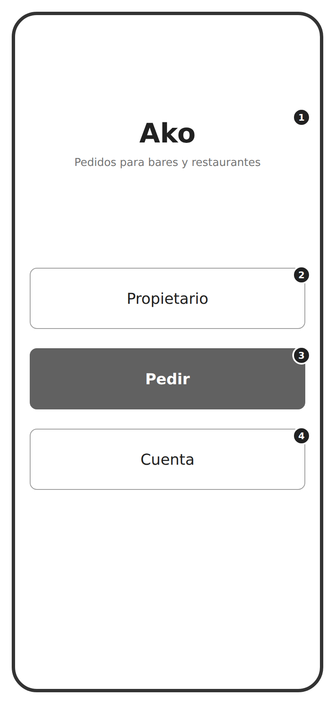

### `01a-selector` — Selector de rol (nivel 1)

| # | Elemento | Nivel |
|---|---|---|
| 1 | Nombre provisional de la app (P97) | 1 |
| 2 | Propietario: pide el PIN (1c) y abre el Panel | 1 |
| 3 | Pedir: comprueba que hay algún plato VISIBLE; si no, aviso y no entra. Después, 1d | 1 |
| 4 | Cuenta: sin PIN, abre 6a | 1 |

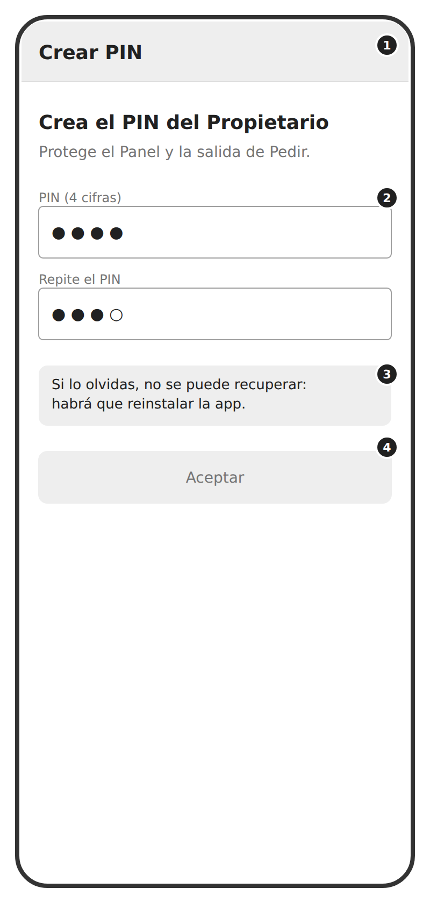

### `01b-crear-pin` — Crear PIN — primer arranque (nivel 1)

| # | Elemento | Nivel |
|---|---|---|
| 1 | Solo en el primer arranque; obligatoria, sin Atrás | 1 |
| 2 | Cuatro cifras ocultas, teclado numérico del sistema | 1 |
| 3 | Aviso visible (ficha 1b); el PIN se guarda como hash con sal (`PBKDF2withHmacSHA256`, 100 000 iteraciones) | 1 |
| 4 | Aceptar desactivado hasta tener 4 cifras dos veces; si no coinciden: "Los PIN no coinciden" y se empieza de nuevo | 1 |

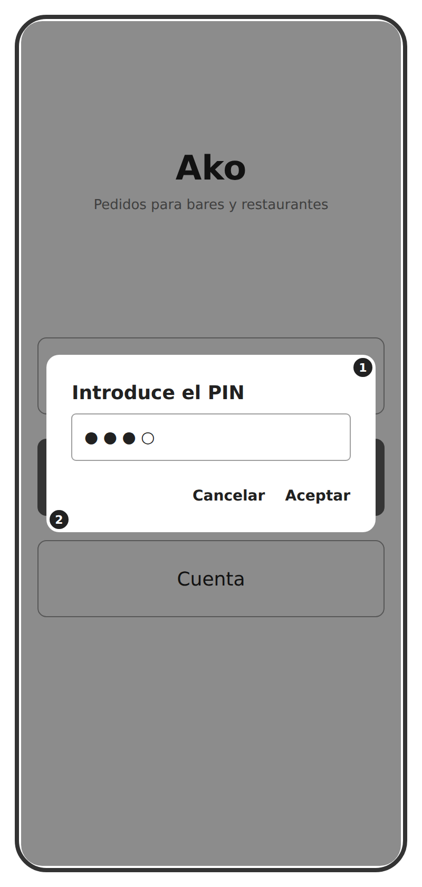

### `dialogo-1c-introducir-pin` — 1c Introducir PIN (diálogo)

| # | Elemento | Nivel |
|---|---|---|
| 1 | Al entrar en Propietario y al salir de Pedir. Cuatro cifras ocultas, teclado numérico | 1 |
| 2 | PIN incorrecto: "PIN incorrecto", el campo se vacía y se sacude. Intentos ilimitados (recorte declarado) | 1 |

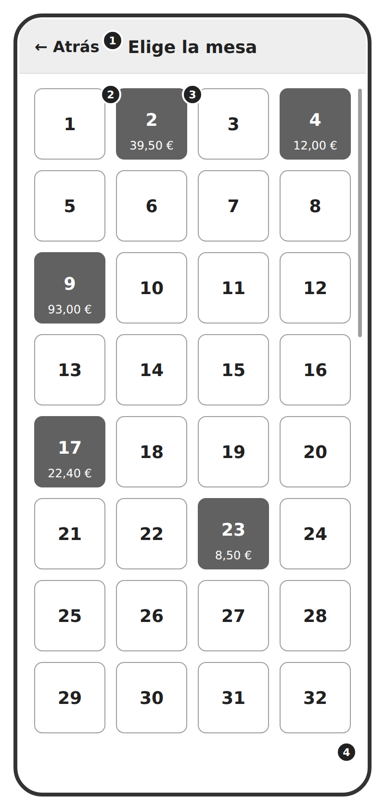

### `01d-elegir-mesa` — Elegir mesa — 4 columnas (nivel 1)

| # | Elemento | Nivel |
|---|---|---|
| 1 | Atrás vuelve al selector sin PIN | 1 |
| 2 | Mesa blanca: sin comanda pendiente (R3) | 1 |
| 3 | Mesa roja: comanda PENDIENTE, con su total **a 12 sp** (P130). Elegible igual: Enviar añade líneas (R2) | 1 |
| 4 | 4 columnas × 15 filas (P98), con scroll. Modo elegir: tocar = "voy a pedir para esta mesa" y abre la carta 5a. El interruptor "Se la doy al cliente" es nivel 2 (incremento 2) | 1 |

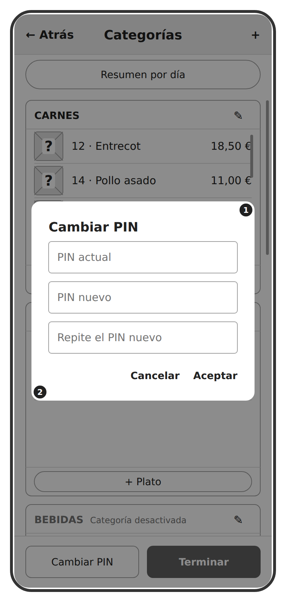

### `dialogo-1e-cambiar-pin` — 1e Cambiar PIN (diálogo)

| # | Elemento | Nivel |
|---|---|---|
| 1 | Primero el actual; si es incorrecto, no se llega a pedir el nuevo | 1 |
| 2 | Es nivel 1: si el camarero deja el trabajo, es la única forma de dejarle fuera | 1 |

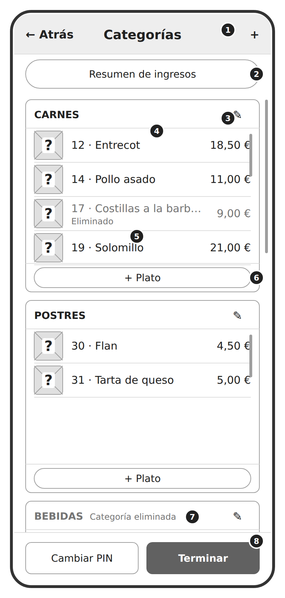

### `02a-panel` — Panel del Propietario (nivel 1)

| # | Elemento | Nivel |
|---|---|---|
| 1 | [+] crea una categoría (2b). Atrás retrocede un paso; Terminar cierra el Panel | 1 |
| 2 | Resumen de ingresos (2g). Etiquetar (inc. 1), Eliminar y recuperar (inc. 8) y Vista previa (inc. 6) son nivel 2 | 1 |
| 3 | Caja por categoría, misma altura fija ~270 dp (P99), scroll propio. Nombre = plegar; lápiz = editar (2b). Flechas ▲▼: nivel 2 (inc. 8) | 1 |
| 4 | Fila de plato: miniatura, número, nombre, precio; tocar = editar (pantalla 3) | 1 |
| 5 | Plato eliminado: la palabra, no solo el color (spec, apartado 8) | 1 |
| 6 | [+ Plato] fijo abajo de la caja: abre la pantalla 3 con la categoría ya elegida | 1 |
| 7 | Categoría eliminada (en el dibujo, Bebidas; P223): se ve, marcada, con sus platos atenuados (R15). La categoría por defecto va siempre la última y sin interruptor (R16) | 1 |
| 8 | Cambiar PIN (1e) y Terminar. Etiquetas (inc. 1) e Idiomas (inc. 10) son nivel 2 | 1 |

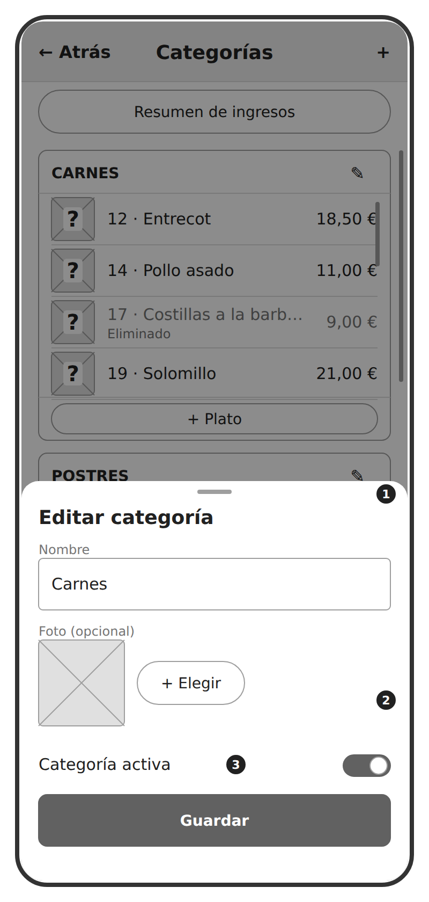

### `02b-editar-categoria` — 2b Crear o editar categoría (hoja inferior)

| # | Elemento | Nivel |
|---|---|---|
| 1 | Hoja inferior (P84). Al crear: solo nombre y foto; el interruptor aparece al editar | 1 |
| 2 | Sin foto: en la carta, círculo con "?" (P224, 23 sep; sustituye a P92) | 1 |
| 3 | Eliminar avisa de las mesas afectadas (2e, R6) y esconde sus platos (R15). La categoría por defecto no lleva interruptor (R16) | 1 |

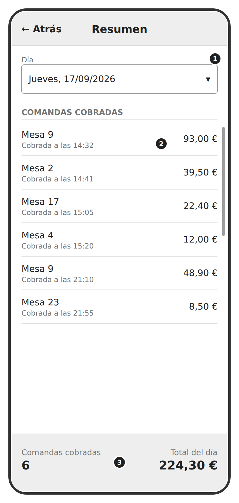

### `02g-resumen-ingresos` — Resumen de ingresos (nivel 1)

| # | Elemento | Nivel |
|---|---|---|
| 1 | Selector de fecha (año, mes y día); por defecto, hoy. Abre el calendario estándar de Android | 1 |
| 2 | Una fila por comanda PAGADA con fecha_cierre en ese día, con mesa, hora e importe; tocarla abre su recibo en solo lectura (reutiliza 6c sin Cobrar) | 1 |
| 3 | Cuántas comandas se cobraron (no mesas: una mesa puede cobrarse varias veces al día) y la suma. Nunca "las mesas en verde" | 1 |

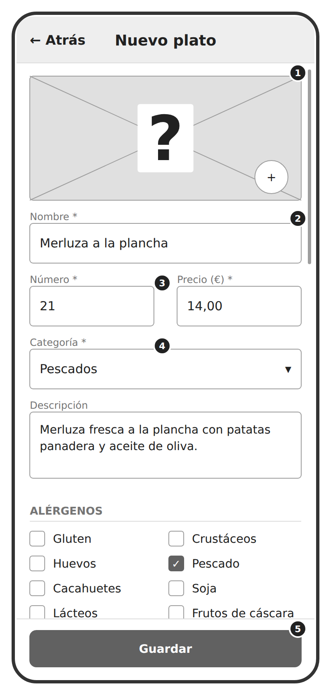

### `03a-formulario-1` — Alta y edición de plato — arriba (nivel 1)

| # | Elemento | Nivel |
|---|---|---|
| 1 | Foto opcional: sin ella, "?" en la carta. Al guardar se redimensiona y comprime (última pieza del nivel 1) | 1 |
| 2 | Obligatorios con *: nombre, número, precio y categoría; sin ellos Guardar no se activa | 1 |
| 3 | Número entero y único (R9): repetido avisa y no deja guardar; cambiarlo avisa | 1 |
| 4 | Categoría: por defecto la que tiene es_por_defecto; viene elegida si se entró desde el [+] de una caja. Eliminada → cadena 3e | 1 |
| 5 | Guardar, fijo abajo; el formulario scrollea por encima | 1 |

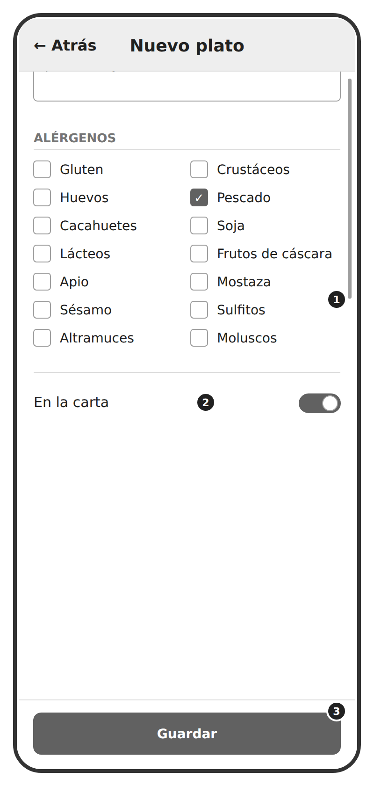

### `03a-formulario-2` — Alta y edición de plato — abajo (nivel 1)

| # | Elemento | Nivel |
|---|---|---|
| 1 | Los 14 alérgenos legales: se marcan, no se crean. Precio 0,00 € se admite; negativo lo rechaza el repositorio (R8, P-C-09) | 1 |
| 2 | **En la carta**: apagarlo elimina el plato y dispara el aviso de mesas afectadas (3d, R6). El **agotado** temporal es otro interruptor, *Disponible*, del incremento 12 | 1 |
| 3 | Salir con cambios sin guardar avisa: "Se perderán los cambios" | 1 |

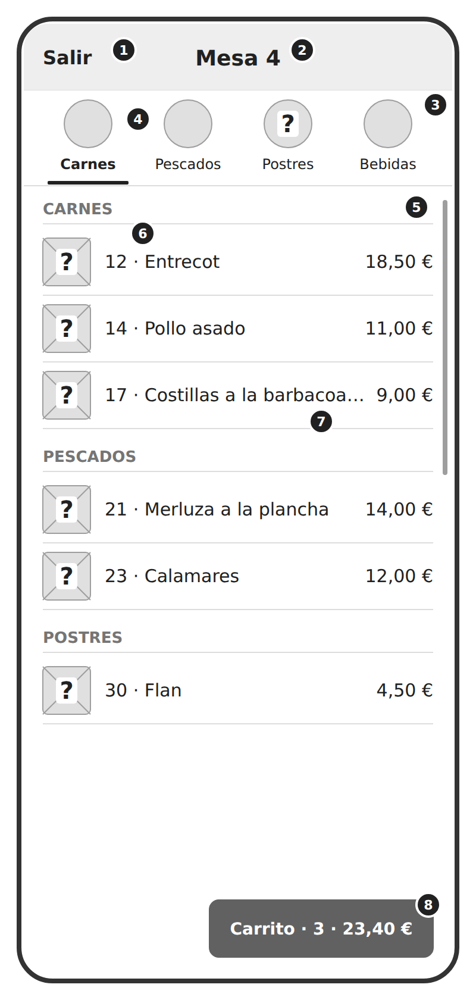

### `05a-carta` — Carta (nivel 1)

| # | Elemento | Nivel |
|---|---|---|
| 1 | Salir: pide el PIN (nivel 1, P41); si hay platos sin enviar, antes el aviso de RF-38 | 1 |
| 2 | Mesa elegida en 1d (P89) | 1 |
| 3 | Fila de categorías, fija, con scroll horizontal (P86); la categoría por defecto siempre la última | 1 |
| 4 | Categoría activa resaltada; tocarla salta a su sección. Con foto pequeña (P87); sin foto, círculo con "?" (P224, 23 sep; sustituye a P92) | 1 |
| 5 | Sección por categoría; una sola lista | 1 |
| 6 | Plato visible: miniatura ("?" si no hay foto, P93), número, nombre, precio. Tocar abre 5b | 1 |
| 7 | Nombre largo cortado con "…"; en la ficha se ve entero | 1 |
| 8 | Carrito como pastilla abajo a la derecha: número de platos y total. Abre 5c | 1 |

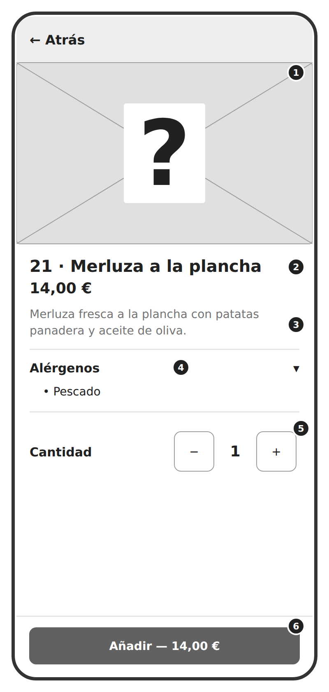

### `05b-ficha-plato` — Ficha del plato (nivel 1)

| # | Elemento | Nivel |
|---|---|---|
| 1 | Foto grande; "?" si no hay foto | 1 |
| 2 | Número, nombre entero y precio | 1 |
| 3 | Descripción (texto de ejemplo) | 1 |
| 4 | Alérgenos desplegables; si no hay ninguno marcado: "El restaurante no ha indicado alérgenos para este plato. Pregunta al personal." | 1 |
| 5 | Cantidad de 1 a 99; los botones se bloquean en los límites (R4) | 1 |
| 6 | Añadir con el importe; el mismo plato se suma en una línea del carrito | 1 |

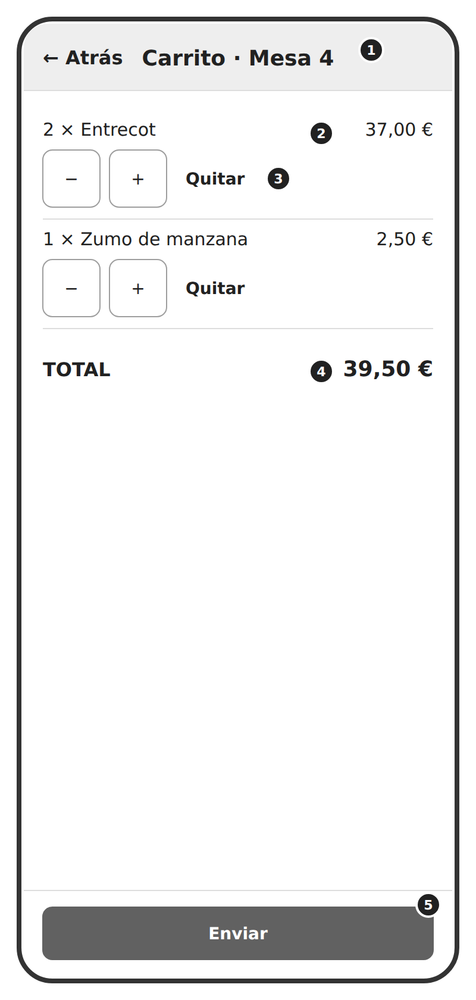

### `05c-carrito` — Carrito (nivel 1)

| # | Elemento | Nivel |
|---|---|---|
| 1 | Mesa a la que se envía | 1 |
| 2 | Línea: cantidad, nombre e importe (precio × cantidad, R10) | 1 |
| 3 | Cambiar cantidad o quitar la línea; máximo 99 (R4) | 1 |
| 4 | Total calculado, no guardado (R10) | 1 |
| 5 | Enviar: confirma mesa y total, y crea o amplía la comanda (R2). Desactivado con el carrito vacío (R4) | 1 |

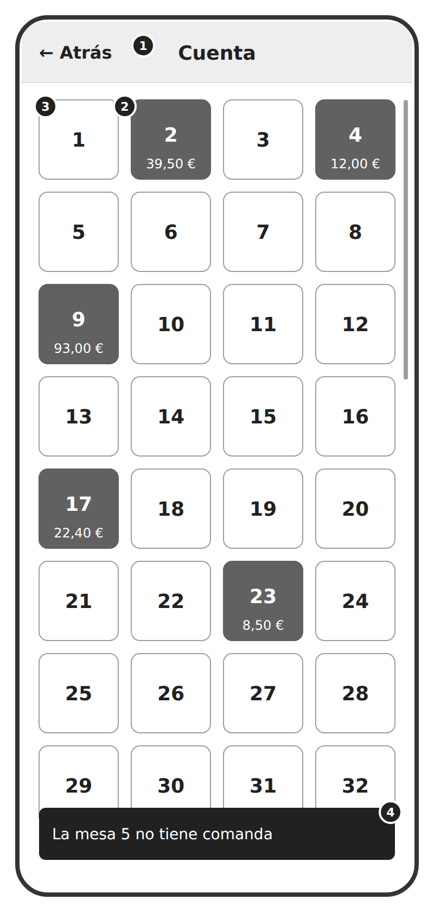

### `06a-rejilla-mesas` — Cuenta — rejilla de mesas, modo gestionar (nivel 1)

| # | Elemento | Nivel |
|---|---|---|
| 1 | Sin PIN. Atrás vuelve al selector | 1 |
| 2 | Roja: comanda PENDIENTE con su total **a 12 sp** (P130); tocar abre 6b | 1 |
| 3 | Blanca: sin comanda (R3). En el nivel 1 tocarla solo informa (abajo); **abrir la carta desde aquí es nivel 2, incremento 9**. El verde es nivel 3 | 1 |
| 4 | Aviso breve (snackbar) al tocar una mesa blanca [Claude]: texto no fijado en la ficha | 1 |

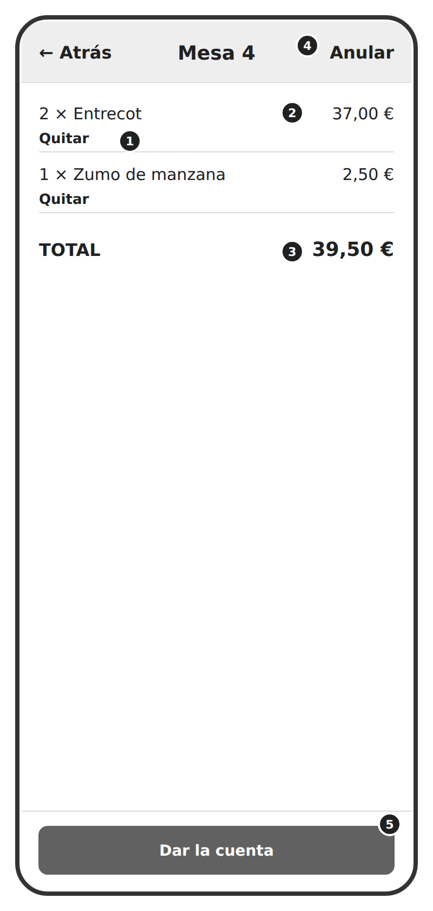

### `06b-comanda` — Comanda de la mesa (nivel 1)

| # | Elemento | Nivel |
|---|---|---|
| 1 | Quitar la línea entera (nivel 1 desde P103; con sus modificadores, CASCADE R11). Sin aviso, salvo si es la última (R7) | 1 |
| 2 | Líneas con nombre y precio congelados (R14). **Cambiar cantidades y [+ Añadir platos] siguen en el nivel 2, incremento 9**: lo nuevo se pide desde Pedir | 1 |
| 3 | Total calculado (R10) | 1 |
| 4 | Anular: pide confirmación; ANULADA y la mesa a blanco (R7) | 1 |
| 5 | Dar la cuenta: abre 6c | 1 |

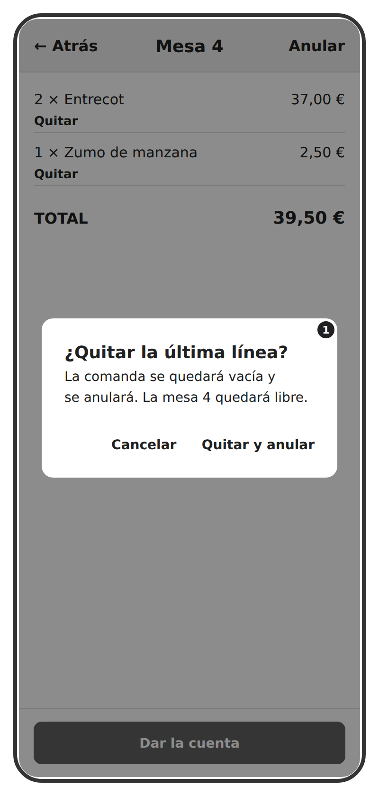

### `dialogo-r7-ultima-linea` — Aviso al quitar la última línea (diálogo, R7)

| # | Elemento | Nivel |
|---|---|---|
| 1 | R7: sin líneas, la comanda pasa a ANULADA con cero líneas en el histórico | 1 |

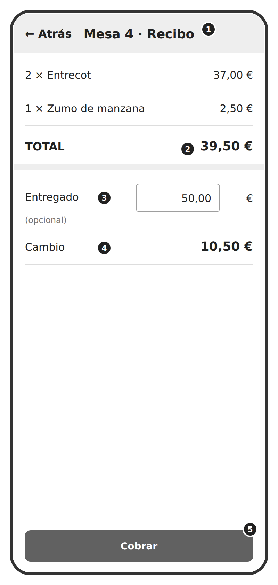

### `06c-recibo` — Recibo y cobro (nivel 1)

| # | Elemento | Nivel |
|---|---|---|
| 1 | El recibo: nombres en español congelados (R14) | 1 |
| 2 | Total de la comanda (R10) | 1 |
| 3 | Calculadora de cambio: lo entregado se teclea; opcional (tarjeta o importe justo) | 1 |
| 4 | Cambio = entregado − total; sale en negativo si falta. No se guarda nada | 1 |
| 5 | Cobrar: pide confirmación; PAGADA con fecha_cierre y la mesa a verde (verde: nivel 3). **[Imprimir] es nivel 2, incremento 9** | 1 |

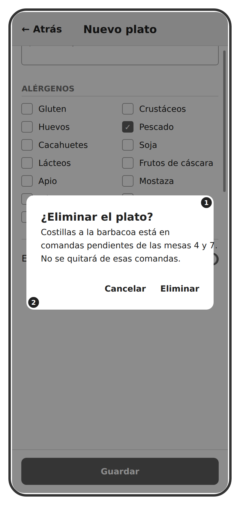

### `dialogo-r6-mesas-afectadas` — 3d / 2e Aviso de mesas afectadas (diálogo, R6)

| # | Elemento | Nivel |
|---|---|---|
| 1 | R6: avisa, no borra líneas. El plato desaparece de la carta al instante | 1 |
| 2 | El mismo aviso, agrupado, al eliminar una categoría (2e): lista de platos y mesas, una sola confirmación | 1 |

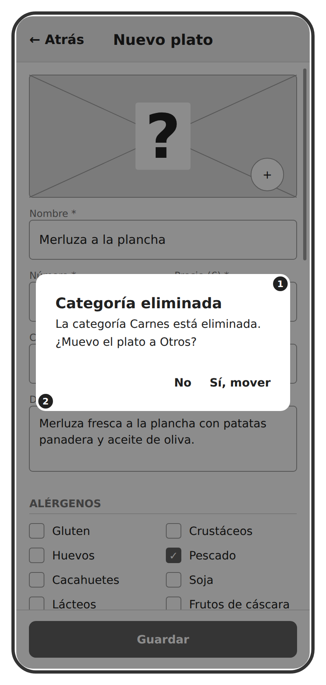

### `dialogo-3e-1-mover` — 3e Aviso 1 de 2: categoría eliminada (diálogo)

| # | Elemento | Nivel |
|---|---|---|
| 1 | Al guardar en una categoría apagada. Sí: se guarda en la categoría por defecto y se ve en la carta | 1 |
| 2 | No: segundo aviso (3e-2) | 1 |

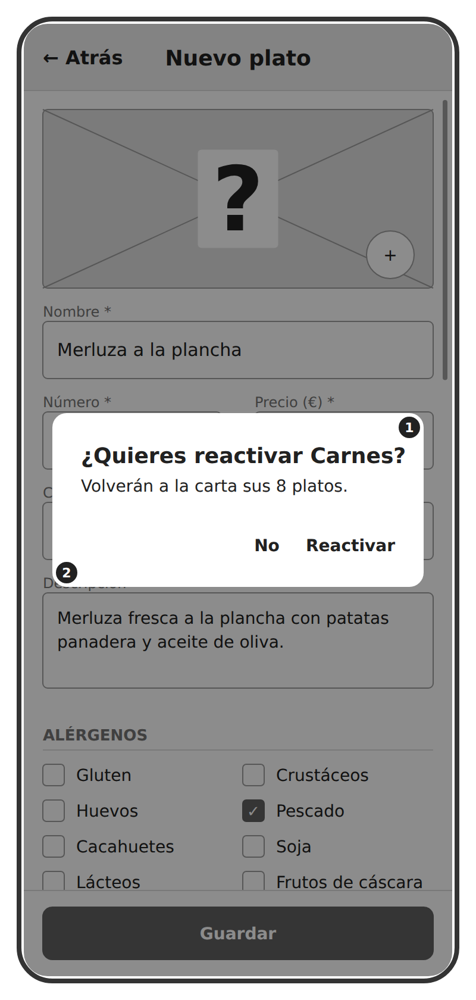

### `dialogo-3e-2-reactivar` — 3e Aviso 2 de 2: reactivar la categoría (diálogo)

| # | Elemento | Nivel |
|---|---|---|
| 1 | Dice cuántos platos vuelven: reactivar devuelve todos, no solo el nuevo (reverso de R6) | 1 |
| 2 | No: el plato se guarda en Carnes, eliminada, y no se muestra. "Ya es decisión del propietario" | 1 |

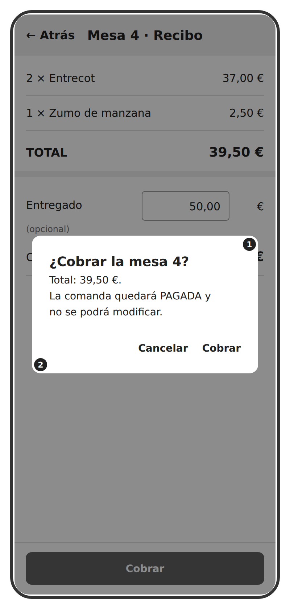

### `dialogo-cobrar` — Confirmación de Cobrar (diálogo)

| # | Elemento | Nivel |
|---|---|---|
| 1 | **Misma caja para Anular** ("¿Anular la comanda de la mesa 4? No se puede deshacer"), **Enviar**, **la puerta de Pedir** y **el aviso de platos sin enviar al salir (RF-38)**. En el código es un solo `ConfirmacionDialog` (P121) | 1 |
| 2 | Cobrar: PAGADA con fecha_cierre; la mesa vuelve a 6a | 1 |
